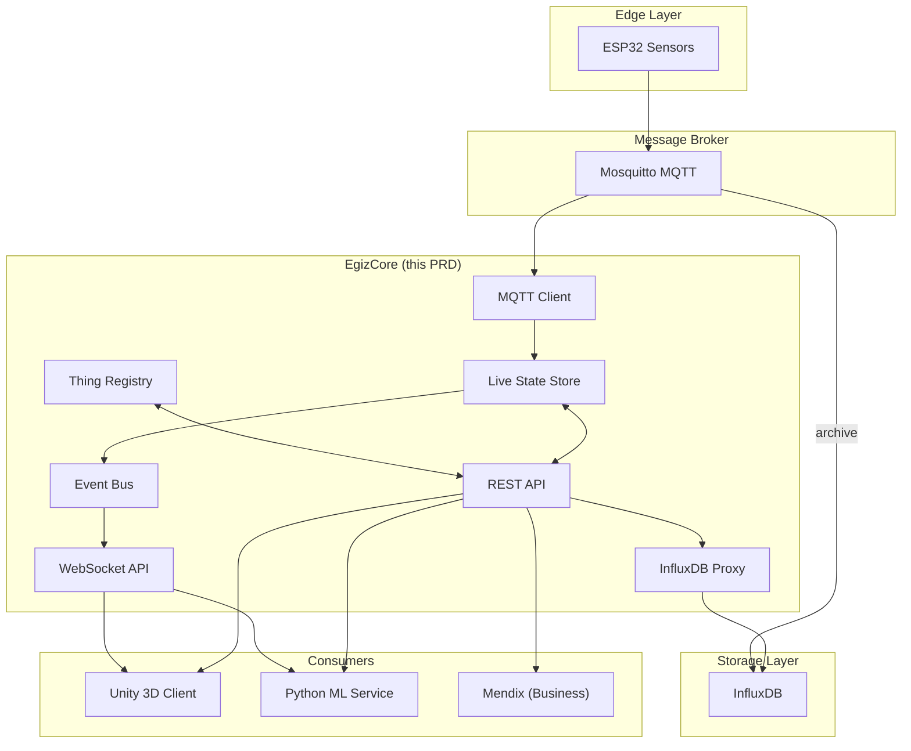

# PRD: EgizCore — Custom Digital Twin Engine

## Overview

EgizCore is the heart of the OpenEgiz platform: a custom-built, high-performance state engine that manages the "Live State" of all physical assets (Things) and provides real-time synchronization to multiple consumers.


---

## Problem Statement

Industrial Digital Twin platforms (e.g., Eclipse Ditto) are complex, resource-heavy, and difficult to customize for food production workflows. OpenEgiz requires a purpose-built, lightweight core engine that:

1. Handles **10,000+ Things** with sub-200ms latency
2. Integrates natively with **InfluxDB** for historical telemetry
3. Provides **WebSocket streaming** to Unity 3D clients
4. Exposes **REST API** for business systems (Mendix)
5. Triggers **ML anomaly detection** in real-time

---

## Goals

| ID | Goal |
|----|------|
| **G-1** | Build EgizCore in **Go** for high concurrency and performance |
| **G-2** | Achieve **<200ms** sensor-to-visualization latency |
| **G-3** | Support **100,000+ msg/sec** ingestion throughput |
| **G-4** | Provide unified API for all consumers (Unity, Mendix, ML Service) |
| **G-5** | Enable historical queries via **InfluxDB** integration |
| **G-6** | Deploy as single Docker container, horizontally scalable |

---

## Scope

### In Scope

- Thing Registry (CRUD for digital twin entities)
- Live State Store (in-memory current state)
- MQTT Client (sensor data ingestion from ESP32)
- REST API (CRUD operations, queries, history proxy)
- WebSocket API (real-time subscriptions)
- InfluxDB integration (historical query proxy)
- Event Bus (internal pub/sub for state changes)
- Docker containerization

### Out of Scope

- Unity client development (separate PRD)
- ML model training (handled by ML service)
- Grafana dashboard design
- Production security (Phase 2)
- Multi-tenant isolation (Phase 3)
- State persistence/recovery (Phase 2)

---

## Architecture



---

## Thing Model

A "Thing" represents a single physical asset in the factory:

```go
type Thing struct {
    ID           string                 `json:"id"`           // e.g., "factory:oven-001"
    Type         string                 `json:"type"`         // e.g., "oven", "mixer"
    Metadata     map[string]any         `json:"metadata"`     // Static: name, location, model
    Features     map[string]Feature     `json:"features"`     // Dynamic: electrical, thermal, status
    Relationships []Relationship        `json:"relationships"`// Links to other Things
    Version      int64                  `json:"version"`      // Optimistic concurrency
    LastUpdated  time.Time              `json:"lastUpdated"`
}

type Feature struct {
    ID           string         `json:"id"`
    Properties   map[string]any `json:"properties"`   // Current sensor values
    DesiredState map[string]any `json:"desiredState"` // For command/control
}

type Relationship struct {
    Type     string `json:"type"`     // "partOf", "connectedTo"
    TargetID string `json:"targetId"` // Target Thing ID
}
```

### Example: Oven Thing

```json
{
  "id": "factory:oven-001",
  "type": "oven",
  "metadata": {
    "name": "Main Oven #1",
    "location": "line-a",
    "manufacturer": "Egiz Industrial"
  },
  "features": {
    "electrical": {
      "properties": {
        "voltage": {"a": 220.5, "b": 219.8, "c": 221.0},
        "current": {"a": 15.2, "b": 14.8, "c": 15.5},
        "power_factor": 0.92
      }
    },
    "thermal": {
      "properties": {
        "temperature_zones": [185.0, 190.0, 188.5],
        "setpoint": 190.0
      }
    },
    "status": {
      "properties": {
        "operational_state": "running",
        "anomaly": false
      }
    },
    "business_context": {
      "properties": {
        "current_batch": "batch-500",
        "recipe": "white-bread",
        "operator_id": "operator-42"
      }
    }
  },
  "version": 1234,
  "lastUpdated": "2026-01-27T10:30:00Z"
}
```

---

## Functional Requirements

### FR-1: Thing Registry

| Requirement | Description |
|-------------|-------------|
| FR-1.1 | Create, Read, Update, Delete Things |
| FR-1.2 | Query Things by type, metadata, and feature properties |
| FR-1.3 | Optimistic concurrency via version field |
| FR-1.4 | In-memory storage with mutex protection |

### FR-2: Live State Store

| Requirement | Description |
|-------------|-------------|
| FR-2.1 | Partial feature updates without replacing entire Thing |
| FR-2.2 | Atomic version increment on each update |
| FR-2.3 | High-throughput: 100,000+ updates/sec |
| FR-2.4 | Memory-efficient update propagation |

### FR-3: MQTT Ingestion

| Requirement | Description |
|-------------|-------------|
| FR-3.1 | Subscribe to configurable MQTT topic patterns |
| FR-3.2 | Parse JSON payloads from ESP32 devices |
| FR-3.3 | Map device IDs to Thing IDs via configuration |
| FR-3.4 | Handle reconnection with exponential backoff |
| FR-3.5 | Emit metrics: messages/sec, queue depth |

### FR-4: REST API

| Endpoint | Method | Description |
|----------|--------|-------------|
| `/api/v1/things` | GET | List Things (paginated) |
| `/api/v1/things` | POST | Create Thing |
| `/api/v1/things/{id}` | GET | Get Thing |
| `/api/v1/things/{id}` | DELETE | Delete Thing |
| `/api/v1/things/{id}/features/{feature}` | GET | Get Feature |
| `/api/v1/things/{id}/features/{feature}` | PUT | Update Feature |
| `/api/v1/query` | POST | Query with filters |
| `/api/v1/things/{id}/history` | GET | Historical data (proxy to InfluxDB) |
| `/health` | GET | Health check |

### FR-5: WebSocket API

| Requirement | Description |
|-------------|-------------|
| FR-5.1 | Endpoint: `ws://host/api/v1/ws` |
| FR-5.2 | Subscribe to single Thing: `{"action": "subscribe", "thingId": "..."}` |
| FR-5.3 | Subscribe by filter: `{"action": "subscribe", "filter": {"type": "oven"}}` |
| FR-5.4 | Receive state changes: `{"event": "StateChanged", ...}` |
| FR-5.5 | Heartbeat every 30 seconds |
| FR-5.6 | Graceful client disconnect handling |

### FR-6: InfluxDB Integration

| Requirement | Description |
|-------------|-------------|
| FR-6.1 | Proxy historical queries to InfluxDB |
| FR-6.2 | Support time range and feature filtering |
| FR-6.3 | Return unified JSON format |
| FR-6.4 | Use InfluxDB v2 client library |

---

## Non-Functional Requirements

| ID | Requirement | Target |
|----|-------------|--------|
| NFR-1 | Sensor-to-WebSocket latency | **<200ms** |
| NFR-2 | MQTT ingestion throughput | **100,000 msg/sec** |
| NFR-3 | Thing capacity | **10,000+ Things** |
| NFR-4 | Concurrent WebSocket clients | **1,000+ clients** |
| NFR-5 | Container memory footprint | **<512MB** (10k Things) |
| NFR-6 | Startup time | **<5 seconds** |
| NFR-7 | Availability | **99.9%** (single node) |

---

## Security Requirements (Phase 2)

> [!IMPORTANT]
> MVP phase defers authentication. Phase 2 must implement:

| ID | Requirement |
|----|-------------|
| SEC-1 | JWT authentication for REST API |
| SEC-2 | API key authentication for M2M (Mendix, ML) |
| SEC-3 | WebSocket token validation on connect |
| SEC-4 | Rate limiting: 100 req/sec per client |
| SEC-5 | Input validation (Zod-style schemas) |
| SEC-6 | TLS termination (reverse proxy) |
| SEC-7 | No sensitive data in logs |

---

## API Design

### REST Examples

**Create Thing:**
```http
POST /api/v1/things
Content-Type: application/json

{
  "id": "factory:oven-001",
  "type": "oven",
  "metadata": {"name": "Main Oven #1", "location": "line-a"}
}
```

**Update Feature (partial):**
```http
PUT /api/v1/things/factory:oven-001/features/electrical
Content-Type: application/json

{
  "properties": {
    "voltage": {"a": 221.0, "b": 220.5, "c": 219.8}
  }
}
```

**Query Things:**
```http
POST /api/v1/query
Content-Type: application/json

{
  "filter": {"type": "oven", "metadata.location": "line-a"},
  "limit": 50
}
```

**Historical Query:**
```http
GET /api/v1/things/factory:oven-001/history?from=2026-01-27T00:00:00Z&to=2026-01-27T12:00:00Z&feature=electrical
```

### WebSocket Protocol

**Subscribe:**
```json
{"action": "subscribe", "thingId": "factory:oven-001"}
```

**Unsubscribe:**
```json
{"action": "unsubscribe", "thingId": "factory:oven-001"}
```

**State Change Event (from server):**
```json
{
  "event": "StateChanged",
  "thingId": "factory:oven-001",
  "feature": "electrical",
  "properties": {"voltage": {"a": 221.0}},
  "version": 1235,
  "timestamp": "2026-01-27T10:30:05Z"
}
```

---

## Technical Stack

| Component | Technology | Rationale |
|-----------|------------|-----------|
| Language | **Go 1.25.6** | High concurrency, low latency, single binary |
| HTTP Router | `go-chi/chi` | Lightweight, idiomatic Go |
| WebSocket | `gorilla/websocket` | Battle-tested, full-featured |
| MQTT Client | `eclipse/paho.mqtt.golang` | Reference implementation |
| InfluxDB Client | `influxdata/influxdb-client-go` | Official v2 client |
| Observability | OpenTelemetry | Traces, metrics, logs |
| Config | `koanf` + env vars | Flexible config management |
| Build | `Makefile` + Docker | Standard workflow |

### Directory Structure

```
egizcore/
├── cmd/
│   └── egizcore/           # Main entry point
│       └── main.go
├── internal/
│   ├── config/             # Configuration loading
│   ├── thing/              # Thing model & registry
│   │   ├── model.go
│   │   ├── registry.go
│   │   └── statestore.go
│   ├── mqtt/               # MQTT client
│   ├── api/                # REST API handlers
│   ├── ws/                 # WebSocket handlers
│   ├── influx/             # InfluxDB client
│   └── eventbus/           # Internal event pub/sub
├── pkg/                    # Public utilities (if any)
├── api/
│   └── openapi.yaml        # OpenAPI spec
├── deployments/
│   ├── docker-compose.yml
│   └── Dockerfile
├── configs/
│   └── config.yaml
├── Makefile
├── go.mod
└── README.md
```

---

## Implementation Plan

### Phase 1: Core Engine (Week 1)

| Step | Task |
|------|------|
| 1.1 | Initialize Go project with module and directory structure |
| 1.2 | Define Thing, Feature, Relationship structs |
| 1.3 | Implement Thing Registry with in-memory storage |
| 1.4 | Implement Live State Store with partial updates |
| 1.5 | Create Event Bus for state change notifications |
| 1.6 | Write unit tests for registry and state store |

### Phase 2: Ingestion & APIs (Week 2)

| Step | Task |
|------|------|
| 2.1 | Implement MQTT client with topic subscription |
| 2.2 | Build REST API endpoints (chi) |
| 2.3 | Build WebSocket subscription server |
| 2.4 | Add InfluxDB query proxy |
| 2.5 | Generate OpenAPI spec |
| 2.6 | Write integration tests |

### Phase 3: Containerization (Week 2)

| Step | Task |
|------|------|
| 3.1 | Create Dockerfile (multi-stage build) |
| 3.2 | Create docker-compose.yml with all services |
| 3.3 | Add health checks and readiness probes |
| 3.4 | Create configuration via env vars |
| 3.5 | Document deployment in README |

### Phase 4: Observability (Week 3)

| Step | Task |
|------|------|
| 4.1 | Add structured logging (slog) |
| 4.2 | Instrument with OpenTelemetry metrics |
| 4.3 | Create Grafana dashboard for EgizCore |
| 4.4 | Add rate metrics: msgs/sec, latency percentiles |

---

## Verification Plan

### Automated Tests

| Test | Command |
|------|---------|
| Unit tests | `go test ./...` |
| Race detector | `go test -race ./...` |
| Benchmark | `go test -bench=. ./internal/thing/...` |
| Integration | `docker-compose up -d && go test ./tests/integration` |

### Manual Verification

- [ ] Publish MQTT message → verify WebSocket client receives update <200ms
- [ ] Create 10,000 Things → verify memory <512MB
- [ ] Connect 100 WebSocket clients → verify no message loss
- [ ] Query historical data → verify InfluxDB returns correct range
- [ ] Restart EgizCore → verify state is empty (ephemeral)

### Success Metrics

| Metric | Target | Measurement |
|--------|--------|-------------|
| Latency (p99) | <200ms | OpenTelemetry histogram |
| Throughput | >100k msg/sec | Prometheus counter |
| Memory | <512MB | Container stats |
| Error rate | <0.01% | Error counter |

---

## Open Questions

1. **State Persistence**: Should EgizCore snapshot state to Redis for restart recovery, or rely on re-population from Mendix + sensors?
2. **Topic Schema**: Confirm MQTT topic structure for ESP32 devices (e.g., `sensors/{device_id}/telemetry`).
3. **Concurrency Model**: Actor model vs channels for entity updates at scale?
4. **gRPC Addition**: Should we add gRPC streaming alongside WebSocket for Unity?
5. **Rate Limiting Strategy**: Per-IP, per-user, or per-Thing?

---

## Dependencies

| Dependency | Owner | Status |
|------------|-------|--------|
| MQTT topic schema | Hardware team | 🔴 Needed |
| InfluxDB retention policy | DevOps | 🟡 In progress |
| Mendix API contract | Business team | 🟡 Draft |
| Unity WebSocket client | Unity team | 🔵 Planned |

---

## Revision History

| Date | Version | Author | Changes |
|------|---------|--------|---------|
| 2026-01-27 | 1.0 | AI | Initial EgizCore-specific PRD |
