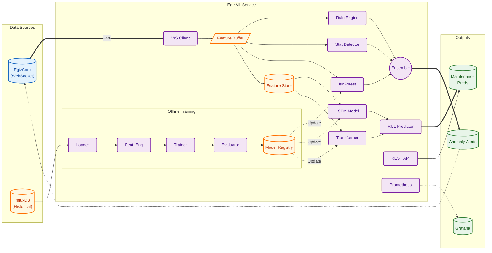
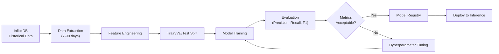

# PRD: EgizML — Machine Learning Anomaly Detection & Predictive Maintenance

## Overview

EgizML is the intelligence layer of the OpenEgiz platform: a Python-based machine learning service that performs real-time anomaly detection and predictive maintenance on factory equipment. It uses a hybrid approach combining rule-based logic, statistical methods, and ML models to identify equipment issues before they cause failures.


---

## Problem Statement

Factory equipment failures result in costly downtime, product waste, and safety risks. Traditional threshold-based monitoring misses subtle degradation patterns. OpenEgiz requires:

1. **Real-time anomaly detection** for immediate alerts
2. **Predictive maintenance** to forecast failures days in advance
3. **Hybrid approach** combining rules, statistics, and ML for reliability
4. **Low-latency inference** (<100ms for real-time anomalies)
5. **Continuous model improvement** from historical data

---

## Goals

| ID | Goal |
|----|------|
| **G-1** | Detect equipment anomalies in **real-time** (<100ms latency) |
| **G-2** | Predict equipment failures **24-72 hours** in advance |
| **G-3** | Achieve **>95% precision** to minimize false alarms |
| **G-4** | Support **hybrid approach**: rules + statistics + ML |
| **G-5** | Process **100,000+ data points/sec** across all equipment |
| **G-6** | Provide **explainable** anomaly reasons |
| **G-7** | Enable **continuous learning** from operator feedback |

---

## Scope

### In Scope

- Real-time anomaly detection service
- Predictive maintenance model pipeline
- Rule-based threshold checks
- Statistical anomaly detection (Z-score, IQR)
- ML models (Isolation Forest, LSTM, Transformer)
- WebSocket client for EgizCore integration
- REST API for predictions and model management
- Model training pipeline with InfluxDB data
- Anomaly explanation generation
- Docker containerization
- Prometheus metrics

### Out of Scope

- Edge inference on ESP32 (future phase)
- AutoML/hyperparameter tuning UI
- Multi-tenant model isolation
- GPU cluster training (single GPU sufficient)
- Custom model development UI
- Integration with external ML platforms

---

## Architecture



---

## Anomaly Detection Approach

### Tier 1: Rule-Based Detection (Immediate)

Fast, deterministic checks for known failure modes.

| Rule Type | Example | Latency |
|-----------|---------|---------|
| Threshold | Temperature > 250°C | <1ms |
| Rate of Change | Temp increase > 10°C/min | <5ms |
| Value Comparison | Current phase imbalance > 15% | <1ms |
| Pattern Match | Power oscillation detected | <10ms |

### Tier 2: Statistical Detection (Fast)

Detect deviations from normal operating ranges.

| Method | Use Case | Latency |
|--------|----------|---------|
| Z-Score | Single metric deviation | <5ms |
| Modified Z-Score | Robust to outliers | <5ms |
| IQR | Identify extreme values | <5ms |
| EWMA | Trend detection | <10ms |
| Seasonal Decomposition | Time-of-day patterns | <50ms |

### Tier 3: ML-Based Detection (Comprehensive)

Detect complex, multi-variate anomalies.

| Model | Use Case | Latency |
|-------|----------|---------|
| Isolation Forest | Multi-variate anomalies | <20ms |
| One-Class SVM | Equipment-specific baseline | <30ms |
| Autoencoder | Reconstruction error | <50ms |
| LSTM | Temporal pattern deviation | <100ms |

### Ensemble Strategy

```python
def detect_anomaly(data_point):
    scores = {
        'rules': rule_engine.check(data_point),      # 0 or 1
        'stats': stat_detector.score(data_point),    # 0.0 - 1.0
        'ml': ml_model.predict(data_point)           # 0.0 - 1.0
    }
    
    # Immediate alert on rule violation
    if scores['rules'] == 1:
        return Anomaly(confidence=1.0, source='rule')
    
    # Weighted ensemble for probabilistic detection
    combined = 0.3 * scores['stats'] + 0.7 * scores['ml']
    
    if combined > 0.8:
        return Anomaly(confidence=combined, source='ensemble')
    
    return None
```

---

## Predictive Maintenance Approach

### Remaining Useful Life (RUL) Prediction

Estimate time until equipment requires maintenance.

| Model | Input | Output | Horizon |
|-------|-------|--------|---------|
| LSTM | 24h sensor history | RUL (hours) | 1-72 hours |
| Transformer | 7d sensor history | Failure probability | 1-7 days |
| Gradient Boosting | Aggregated features | Maintenance score | 1-30 days |

### Feature Engineering

| Feature Category | Examples |
|-----------------|----------|
| Raw Metrics | Temperature, current, voltage |
| Rolling Statistics | Mean, std, min, max (1h, 6h, 24h) |
| Rate of Change | First derivative, acceleration |
| Frequency Domain | FFT coefficients for vibration |
| Cross-Correlation | Phase imbalance, temp-power ratio |
| Operational Context | Runtime hours, cycle count |

### Training Pipeline



---

## Functional Requirements

### FR-1: Real-Time Ingestion

| Requirement | Description |
|-------------|-------------|
| FR-1.1 | Connect to EgizCore WebSocket for live data |
| FR-1.2 | Subscribe to all equipment or filter by type |
| FR-1.3 | Buffer last N data points per Thing (configurable) |
| FR-1.4 | Handle reconnection with state recovery |
| FR-1.5 | Process 100,000+ data points per second |

### FR-2: Rule Engine

| Requirement | Description |
|-------------|-------------|
| FR-2.1 | Load rules from YAML configuration |
| FR-2.2 | Support threshold, range, rate-of-change rules |
| FR-2.3 | Rules configurable per equipment type |
| FR-2.4 | Hot-reload rules without restart |
| FR-2.5 | Log all rule violations with context |

### FR-3: Statistical Detection

| Requirement | Description |
|-------------|-------------|
| FR-3.1 | Compute Z-score for each metric |
| FR-3.2 | Maintain rolling statistics (mean, std) |
| FR-3.3 | Detect seasonal patterns (time-of-day) |
| FR-3.4 | Configurable sensitivity per metric |
| FR-3.5 | Warm-up period before detection (1 hour) |

### FR-4: ML Inference

| Requirement | Description |
|-------------|-------------|
| FR-4.1 | Load trained models from model registry |
| FR-4.2 | Run Isolation Forest on feature vectors |
| FR-4.3 | Batch inference for efficiency |
| FR-4.4 | Model versioning and A/B testing |
| FR-4.5 | Fallback to statistical detection if model fails |

### FR-5: Anomaly Output

| Requirement | Description |
|-------------|-------------|
| FR-5.1 | Publish anomaly events to EgizCore via REST |
| FR-5.2 | Include: thing_id, anomaly_type, confidence, explanation |
| FR-5.3 | Deduplicate alerts (same anomaly within 5 min) |
| FR-5.4 | Support severity levels: info, warning, critical |
| FR-5.5 | Store anomaly history in database |

### FR-6: Predictive Models

| Requirement | Description |
|-------------|-------------|
| FR-6.1 | Train LSTM model on historical failure data |
| FR-6.2 | Generate RUL predictions every hour |
| FR-6.3 | Expose predictions via REST API |
| FR-6.4 | Update feature store continuously |
| FR-6.5 | Retrain models weekly on new data |

### FR-7: REST API

| Endpoint | Method | Description |
|----------|--------|-------------|
| `/api/v1/health` | GET | Health check |
| `/api/v1/anomalies` | GET | List recent anomalies |
| `/api/v1/anomalies/{thing_id}` | GET | Anomalies for specific Thing |
| `/api/v1/predictions/{thing_id}` | GET | RUL prediction for Thing |
| `/api/v1/predictions` | GET | All maintenance predictions |
| `/api/v1/models` | GET | List registered models |
| `/api/v1/models/{id}/metrics` | GET | Model performance metrics |
| `/api/v1/rules` | GET/PUT | View/update detection rules |
| `/api/v1/feedback` | POST | Submit operator feedback |

### FR-8: Training Pipeline

| Requirement | Description |
|-------------|-------------|
| FR-8.1 | Extract training data from InfluxDB |
| FR-8.2 | Feature engineering pipeline |
| FR-8.3 | Cross-validation for model selection |
| FR-8.4 | Track experiments with MLflow |
| FR-8.5 | Register models with versioning |
| FR-8.6 | Automated retraining on schedule |

---

## Non-Functional Requirements

| ID | Requirement | Target |
|----|-------------|--------|
| NFR-1 | Anomaly detection latency | **<100ms** (p99) |
| NFR-2 | Ingestion throughput | **100,000+ points/sec** |
| NFR-3 | Precision (anomaly detection) | **>95%** |
| NFR-4 | Recall (anomaly detection) | **>85%** |
| NFR-5 | Prediction horizon | **24-72 hours** |
| NFR-6 | Model inference time | **<50ms** per batch |
| NFR-7 | Container memory | **<4GB** |
| NFR-8 | Training time | **<2 hours** (weekly retrain) |
| NFR-9 | Availability | **99.9%** |

---

## Model Specifications

### Isolation Forest (Real-Time)

| Parameter | Value |
|-----------|-------|
| n_estimators | 100 |
| max_samples | 256 |
| contamination | 0.01 |
| Features | 15 (electrical + thermal) |
| Inference batch | 100 Things |

### LSTM (Predictive)

| Parameter | Value |
|-----------|-------|
| Layers | 2 (64, 32 units) |
| Sequence length | 24 hours (hourly) |
| Dropout | 0.2 |
| Optimizer | Adam |
| Loss | MSE |
| Training data | 90 days per equipment |

### Transformer (Predictive)

| Parameter | Value |
|-----------|-------|
| Attention heads | 4 |
| Encoder layers | 2 |
| d_model | 64 |
| Sequence length | 168 hours (7 days) |
| Positional encoding | Sinusoidal |

---

## Technical Stack

| Component | Technology | Rationale |
|-----------|------------|-----------|
| Language | **Python 3.11** | ML ecosystem |
| Web Framework | **FastAPI** | Async, high-performance |
| ML Framework | **scikit-learn** | Classical ML |
| Deep Learning | **PyTorch** | LSTM, Transformer |
| Data Processing | **Pandas, NumPy** | Feature engineering |
| Time Series | **statsmodels** | Statistical methods |
| Experiment Tracking | **MLflow** | Model versioning |
| WebSocket | **websockets** | Async WebSocket |
| Database | **SQLite/PostgreSQL** | Anomaly history |
| Queue | **Redis** (optional) | Feature buffer |
| Containerization | **Docker** | Deployment |
| Metrics | **Prometheus** | Observability |

### Directory Structure

```
egizml/
├── src/
│   ├── main.py                    # FastAPI entry point
│   ├── config.py                  # Configuration
│   ├── ingestion/
│   │   ├── websocket_client.py    # EgizCore client
│   │   └── data_buffer.py         # Rolling buffer
│   ├── detection/
│   │   ├── rule_engine.py         # Rule-based detection
│   │   ├── statistical.py         # Z-score, EWMA
│   │   ├── ml_inference.py        # Model inference
│   │   └── ensemble.py            # Combine detectors
│   ├── prediction/
│   │   ├── feature_store.py       # Feature aggregation
│   │   ├── lstm_model.py          # LSTM predictor
│   │   ├── transformer_model.py   # Transformer predictor
│   │   └── rul_predictor.py       # RUL estimation
│   ├── training/
│   │   ├── data_loader.py         # InfluxDB extraction
│   │   ├── feature_engineering.py # Feature pipeline
│   │   ├── trainer.py             # Model training
│   │   └── evaluator.py           # Metrics computation
│   ├── api/
│   │   ├── routes.py              # REST endpoints
│   │   └── schemas.py             # Pydantic models
│   ├── models/
│   │   └── registry.py            # Model registry
│   └── utils/
│       ├── metrics.py             # Prometheus metrics
│       └── explainer.py           # SHAP explanations
├── configs/
│   ├── rules.yaml                 # Detection rules
│   ├── models.yaml                # Model configurations
│   └── config.yaml                # Service configuration
├── models/                        # Saved model files
├── notebooks/                     # Jupyter notebooks
│   ├── eda.ipynb                  # Exploratory analysis
│   └── model_development.ipynb    # Model experiments
├── tests/
│   ├── test_rule_engine.py
│   ├── test_statistical.py
│   └── test_inference.py
├── Dockerfile
├── docker-compose.yml
├── requirements.txt
├── pyproject.toml
└── README.md
```

---

## Rule Configuration Example

```yaml
# configs/rules.yaml
rules:
  oven:
    electrical:
      - name: "high_current"
        condition: "current.total > 100"
        severity: "critical"
        message: "Current exceeds safe limit"
      
      - name: "phase_imbalance"
        condition: "abs(current.a - current.b) / current.a > 0.15"
        severity: "warning"
        message: "Phase current imbalance detected"
      
      - name: "low_power_factor"
        condition: "power_factor < 0.85"
        severity: "info"
        message: "Power factor below optimal"
    
    thermal:
      - name: "overtemperature"
        condition: "max(temperature_zones) > 250"
        severity: "critical"
        message: "Temperature exceeds maximum"
      
      - name: "rapid_heating"
        condition: "rate_of_change(temperature_zones[0]) > 10"
        severity: "warning"
        message: "Rapid temperature increase"
      
      - name: "zone_imbalance"
        condition: "max(temperature_zones) - min(temperature_zones) > 20"
        severity: "warning"
        message: "Temperature zone imbalance"

  mixer:
    electrical:
      - name: "motor_overload"
        condition: "current.total > 50"
        severity: "critical"
        message: "Motor current overload"
```

---

## Anomaly Output Schema

```json
{
  "anomaly_id": "anom-2026-01-29-001",
  "thing_id": "factory:oven-001",
  "timestamp": "2026-01-29T10:30:00.123Z",
  "type": "overtemperature",
  "severity": "critical",
  "confidence": 0.95,
  "source": "rule",
  "feature": "thermal.temperature_zones",
  "value": 255.0,
  "threshold": 250.0,
  "explanation": "Zone 2 temperature (255°C) exceeds maximum safe limit (250°C). Consider reducing heating or checking thermostat.",
  "context": {
    "recent_values": [248, 250, 252, 254, 255],
    "time_in_state": 120,
    "correlated_anomalies": []
  }
}
```

---

## Prediction Output Schema

```json
{
  "thing_id": "factory:oven-001",
  "prediction_time": "2026-01-29T10:00:00Z",
  "predictions": {
    "rul_hours": 156,
    "rul_confidence": 0.85,
    "failure_probability_24h": 0.05,
    "failure_probability_72h": 0.15,
    "recommended_action": "Schedule maintenance within 7 days",
    "degradation_trend": "increasing",
    "contributing_factors": [
      {"feature": "power_factor", "importance": 0.35},
      {"feature": "temperature_variance", "importance": 0.28},
      {"feature": "current_imbalance", "importance": 0.22}
    ]
  },
  "model_version": "lstm-v1.2.0"
}
```

---

## Implementation Plan

### Phase 1: Core Detection (Week 1)

| Step | Task |
|------|------|
| 1.1 | Set up Python project with FastAPI |
| 1.2 | Implement WebSocket client for EgizCore |
| 1.3 | Implement data buffer with rolling window |
| 1.4 | Implement rule engine with YAML config |
| 1.5 | Implement statistical detectors (Z-score, EWMA) |
| 1.6 | Create REST API for anomalies |
| 1.7 | Unit tests for detection components |

### Phase 2: ML Detection (Week 2)

| Step | Task |
|------|------|
| 2.1 | Implement feature extraction pipeline |
| 2.2 | Train Isolation Forest on sample data |
| 2.3 | Implement model registry |
| 2.4 | Implement ensemble combiner |
| 2.5 | Integrate with EgizCore (publish anomalies) |
| 2.6 | Add Prometheus metrics |

### Phase 3: Predictive Models (Week 3)

| Step | Task |
|------|------|
| 3.1 | Implement InfluxDB data loader |
| 3.2 | Implement feature engineering pipeline |
| 3.3 | Train LSTM model on historical data |
| 3.4 | Implement RUL predictor |
| 3.5 | Create prediction REST API |
| 3.6 | Set up MLflow for experiment tracking |

### Phase 4: Production Readiness (Week 4)

| Step | Task |
|------|------|
| 4.1 | Create Dockerfile |
| 4.2 | Create docker-compose.yml |
| 4.3 | Performance optimization |
| 4.4 | Load testing (100k points/sec) |
| 4.5 | Create Grafana dashboard |
| 4.6 | Documentation |

---

## Verification Plan

### Automated Tests

| Test | Command |
|------|---------|
| Unit tests | `pytest tests/` |
| Type checking | `mypy src/` |
| Linting | `ruff check src/` |
| Integration | `pytest tests/integration/` |

### Manual Verification

- [ ] WebSocket connects to EgizCore and receives data
- [ ] Rule engine triggers on configured thresholds
- [ ] Statistical detector identifies outliers
- [ ] ML model produces anomaly scores
- [ ] Anomalies published to EgizCore
- [ ] REST API returns predictions
- [ ] Grafana dashboard shows metrics

### Performance Testing

| Scenario | Target |
|----------|--------|
| Throughput | 100,000 points/sec |
| Latency (p99) | <100ms |
| Memory | <4GB |
| Model inference | <50ms/batch |

### Model Evaluation

| Metric | Target | Measurement |
|--------|--------|-------------|
| Precision | >95% | Cross-validation |
| Recall | >85% | Cross-validation |
| F1 Score | >90% | Cross-validation |
| RUL MAE | <12 hours | Test set |

---

## Open Questions

1. **Labeled Data**: Do we have labeled anomaly/failure data for supervised training?
2. **GPU**: Is GPU available for training? Affects model complexity.
3. **Feedback Loop**: How do operators provide feedback on false positives?
4. **Alert Routing**: Should anomalies go to specific recipients based on severity?
5. **Model Update**: Automatic retraining or manual approval required?

---

## Dependencies

| Dependency | Owner | Status |
|------------|-------|--------|
| EgizCore WebSocket API | EgizCore Team | In progress |
| InfluxDB historical data | DevOps | Required |
| Labeled training data | Operations Team | Required |
| GPU server (optional) | Infrastructure | Nice to have |

---

## Revision History

| Date | Version | Author | Changes |
|------|---------|--------|---------|
| 2026-01-29 | 1.0 | AI | Initial EgizML PRD |
