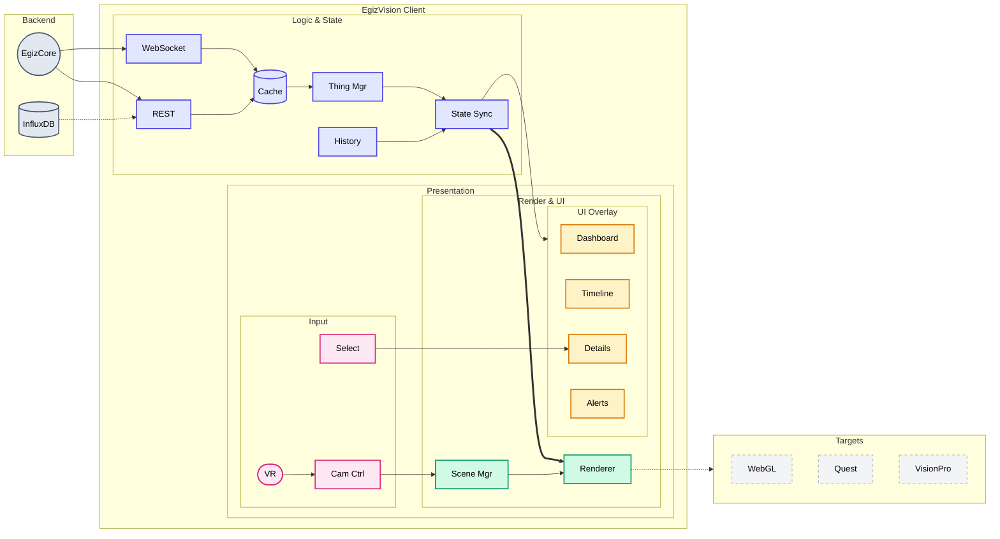

# PRD: EgizVision — Unity 3D Digital Twin Visualization

## Overview

EgizVision is the visualization layer of the OpenEgiz platform: a Unity-based 3D application that renders real-time digital twins of factory equipment with live sensor data overlays. It supports both real-time monitoring and historical analysis, deployed as a WebGL application for browser access and native builds for VR/AR headsets.


---

## Problem Statement

Factory operators and managers need intuitive visualization of equipment status, sensor readings, and anomalies. Traditional SCADA systems are 2D, complex, and require specialized training. OpenEgiz requires:

1. **Immersive 3D visualization** of factory floor and equipment
2. **Real-time sensor data** overlaid on 3D models
3. **Historical playback** for incident analysis
4. **Multi-platform deployment** (WebGL, VR/AR)
5. **Low-latency updates** (<200ms from sensor to visual)

---

## Goals

| ID | Goal |
|----|------|
| **G-1** | Render 3D factory environment with 100+ equipment models |
| **G-2** | Display real-time sensor data with **<200ms** latency |
| **G-3** | Support historical playback with timeline scrubbing |
| **G-4** | Deploy as **WebGL** application for browser access |
| **G-5** | Deploy native builds for **VR headsets** (Quest, Vision Pro) |
| **G-6** | Achieve **60 FPS** on target platforms |
| **G-7** | Visualize anomalies with color coding and alerts |

---

## Scope

### In Scope

- Unity project architecture and scene structure
- WebSocket client for real-time data from EgizCore
- REST client for Thing registry and historical queries
- 3D equipment models (oven, mixer, conveyor)
- Sensor data visualization (gauges, heatmaps, graphs)
- Anomaly highlighting and alert system
- Historical timeline and playback controls
- WebGL build and deployment
- VR/AR build (Meta Quest, Apple Vision Pro)
- Camera controls (orbit, first-person, flythrough)
- Equipment selection and detail panels

### Out of Scope

- 3D model creation (provided by art team)
- Factory layout editor
- Control commands to equipment (Phase 2)
- Multi-user collaboration
- Mobile native apps (iOS/Android)
- Offline mode

---

## Architecture



---

## User Personas

### Factory Operator

- **Goal**: Monitor equipment status at a glance
- **Needs**: Clear visual indicators, quick anomaly identification
- **Platform**: WebGL on control room displays

### Maintenance Engineer

- **Goal**: Diagnose issues using historical data
- **Needs**: Timeline playback, detailed sensor graphs
- **Platform**: WebGL on laptop, VR for immersive inspection

### Plant Manager

- **Goal**: Overview of factory performance
- **Needs**: Dashboard with KPIs, drill-down capability
- **Platform**: WebGL on desktop, VR for tours

---

## User Stories

### US-001: Real-Time Equipment Monitoring

**Description:** As a factory operator, I want to see live sensor data on 3D equipment models so that I can monitor operations at a glance.

**Acceptance Criteria:**
- [ ] 3D factory scene loads with all registered equipment
- [ ] Equipment models display current sensor values (temperature, power)
- [ ] Data updates within 200ms of sensor change
- [ ] Color coding indicates normal (green), warning (yellow), critical (red)
- [ ] Typecheck passes
- [ ] Verify in browser using WebGL build

### US-002: Equipment Selection and Details

**Description:** As an operator, I want to click on equipment to see detailed sensor information so that I can investigate specific machines.

**Acceptance Criteria:**
- [ ] Clicking equipment highlights it and opens detail panel
- [ ] Detail panel shows all features and current values
- [ ] Mini-graphs show last 5 minutes of data
- [ ] Panel closes when clicking elsewhere
- [ ] Typecheck passes
- [ ] Verify in browser using WebGL build

### US-003: Anomaly Visualization

**Description:** As an operator, I want anomalies to be visually prominent so that I can immediately identify problems.

**Acceptance Criteria:**
- [ ] Equipment with anomaly flag pulses red
- [ ] Particle effect draws attention to anomaly
- [ ] Alert notification appears in alert list
- [ ] Audio cue plays on new anomaly (configurable)
- [ ] Typecheck passes
- [ ] Verify in browser using WebGL build

### US-004: Historical Playback

**Description:** As a maintenance engineer, I want to replay historical data so that I can analyze what happened before an incident.

**Acceptance Criteria:**
- [ ] Timeline control shows 24-hour window
- [ ] Dragging timeline scrubs through historical data
- [ ] Play/pause controls for automatic playback
- [ ] Playback speed: 1x, 2x, 5x, 10x
- [ ] Equipment states update based on historical data
- [ ] Current time indicator on timeline
- [ ] Typecheck passes
- [ ] Verify in browser using WebGL build

### US-005: Camera Navigation

**Description:** As a user, I want to navigate the 3D scene intuitively so that I can view equipment from any angle.

**Acceptance Criteria:**
- [ ] Orbit camera around selected equipment (mouse drag)
- [ ] Zoom in/out (scroll wheel)
- [ ] Pan camera (middle mouse button)
- [ ] First-person mode for walkthrough (WASD keys)
- [ ] Quick-travel to equipment (double-click)
- [ ] Typecheck passes
- [ ] Verify in browser using WebGL build

### US-006: VR Immersive Mode

**Description:** As a user with VR headset, I want to walk through the virtual factory so that I can inspect equipment naturally.

**Acceptance Criteria:**
- [ ] Scene renders in stereoscopic 3D
- [ ] Teleportation locomotion (point and click)
- [ ] Grab and inspect equipment detail panels
- [ ] Hand tracking for pointing at equipment
- [ ] Voice command for common actions
- [ ] Typecheck passes
- [ ] Verify on Meta Quest device

### US-007: Dashboard Overview

**Description:** As a plant manager, I want a dashboard showing factory KPIs so that I can assess overall performance.

**Acceptance Criteria:**
- [ ] Dashboard panel shows: total equipment, active, warning, critical counts
- [ ] Energy consumption summary (total kW)
- [ ] Recent alerts list (last 10)
- [ ] Click on dashboard items filters/navigates to relevant equipment
- [ ] Typecheck passes
- [ ] Verify in browser using WebGL build

---

## Functional Requirements

### FR-1: Data Integration

| Requirement | Description |
|-------------|-------------|
| FR-1.1 | Connect to EgizCore WebSocket for real-time updates |
| FR-1.2 | Subscribe to all Things or filter by type/location |
| FR-1.3 | Handle reconnection with exponential backoff |
| FR-1.4 | Fetch Thing registry on startup via REST |
| FR-1.5 | Query historical data via REST for playback |
| FR-1.6 | Cache recent data locally for performance |

### FR-2: Scene Management

| Requirement | Description |
|-------------|-------------|
| FR-2.1 | Load factory layout from configuration |
| FR-2.2 | Instantiate equipment prefabs based on Thing registry |
| FR-2.3 | Position equipment based on metadata (x, y, z coordinates) |
| FR-2.4 | Support LOD (Level of Detail) for performance |
| FR-2.5 | Occlusion culling for large scenes |

### FR-3: Sensor Visualization

| Requirement | Description |
|-------------|-------------|
| FR-3.1 | Display temperature as color gradient on equipment surface |
| FR-3.2 | Show power consumption as floating gauge |
| FR-3.3 | Display status icons above equipment |
| FR-3.4 | Update visualizations smoothly (interpolation) |
| FR-3.5 | Toggle visibility of different sensor overlays |

### FR-4: Anomaly System

| Requirement | Description |
|-------------|-------------|
| FR-4.1 | Subscribe to anomaly events from EgizCore |
| FR-4.2 | Highlight anomalous equipment with shader effect |
| FR-4.3 | Add equipment to alert list |
| FR-4.4 | Play audio notification (configurable) |
| FR-4.5 | Show anomaly type and confidence in detail panel |

### FR-5: Historical Playback

| Requirement | Description |
|-------------|-------------|
| FR-5.1 | Fetch historical data for selected time range |
| FR-5.2 | Buffer data for smooth playback |
| FR-5.3 | Interpolate between data points for smooth animation |
| FR-5.4 | Show timeline with events marked (anomalies, alerts) |
| FR-5.5 | Export selected time range as video (Phase 2) |

### FR-6: User Interface

| Requirement | Description |
|-------------|-------------|
| FR-6.1 | Responsive UI that works at different resolutions |
| FR-6.2 | Dark theme optimized for control room displays |
| FR-6.3 | Keyboard shortcuts for common actions |
| FR-6.4 | Settings panel for preferences (audio, units, etc.) |
| FR-6.5 | Fullscreen toggle |

### FR-7: Platform Support

| Requirement | Description |
|-------------|-------------|
| FR-7.1 | WebGL build with compressed assets |
| FR-7.2 | Meta Quest build with hand tracking |
| FR-7.3 | Apple Vision Pro build (visionOS) |
| FR-7.4 | Adaptive quality settings per platform |

---

## Non-Functional Requirements

| ID | Requirement | Target |
|----|-------------|--------|
| NFR-1 | Frame rate | **60 FPS** (WebGL), **72 FPS** (VR) |
| NFR-2 | Data update latency | **<200ms** sensor to visual |
| NFR-3 | Scene load time | **<10 seconds** (WebGL) |
| NFR-4 | WebGL bundle size | **<50MB** (compressed) |
| NFR-5 | Memory usage | **<2GB** (WebGL), **<4GB** (VR) |
| NFR-6 | Equipment capacity | **500+ Things** rendered |
| NFR-7 | Concurrent WebSocket subscriptions | **1,000 Things** |
| NFR-8 | Browser support | Chrome, Firefox, Edge (latest 2 versions) |

---

## Technical Stack

| Component | Technology | Rationale |
|-----------|------------|-----------|
| Game Engine | **Unity 2022 LTS** | Cross-platform, WebGL, VR support |
| Scripting | **C#** | Unity standard |
| WebSocket | **NativeWebSocket** | WebGL-compatible |
| REST Client | **UnityWebRequest** | Built-in, cross-platform |
| JSON | **Newtonsoft.Json** | Fast, feature-rich |
| UI Framework | **UI Toolkit** | Modern, performant |
| VR SDK | **XR Interaction Toolkit** | Cross-platform VR |
| Charting | **XCharts** or custom | Sensor graphs |
| Build | **Unity Cloud Build** | Automated CI/CD |

### Project Structure

```
EgizVision/
├── Assets/
│   ├── Scripts/
│   │   ├── Core/
│   │   │   ├── GameManager.cs
│   │   │   ├── ThingManager.cs
│   │   │   └── StateSync.cs
│   │   ├── Data/
│   │   │   ├── WebSocketClient.cs
│   │   │   ├── RESTClient.cs
│   │   │   ├── DataCache.cs
│   │   │   └── Models/
│   │   │       ├── Thing.cs
│   │   │       └── Feature.cs
│   │   ├── Visualization/
│   │   │   ├── EquipmentRenderer.cs
│   │   │   ├── SensorOverlay.cs
│   │   │   ├── AnomalyVFX.cs
│   │   │   └── HeatmapShader.cs
│   │   ├── UI/
│   │   │   ├── DashboardPanel.cs
│   │   │   ├── DetailPanel.cs
│   │   │   ├── TimelineControl.cs
│   │   │   └── AlertList.cs
│   │   ├── Input/
│   │   │   ├── CameraController.cs
│   │   │   ├── SelectionSystem.cs
│   │   │   └── VRInputHandler.cs
│   │   └── History/
│   │       └── HistoryPlayer.cs
│   ├── Prefabs/
│   │   ├── Equipment/
│   │   │   ├── Oven.prefab
│   │   │   ├── Mixer.prefab
│   │   │   └── Conveyor.prefab
│   │   └── UI/
│   ├── Scenes/
│   │   ├── Factory.unity
│   │   └── VRFactory.unity
│   ├── Materials/
│   ├── Shaders/
│   │   ├── HeatmapShader.shader
│   │   └── AnomalyPulse.shader
│   ├── UI Toolkit/
│   │   ├── Styles/
│   │   └── UXML/
│   └── StreamingAssets/
│       └── config.json
├── Packages/
├── ProjectSettings/
├── Builds/
│   ├── WebGL/
│   ├── Quest/
│   └── VisionPro/
└── README.md
```

---

## Visual Design

### Color Scheme

| State | Color | Hex |
|-------|-------|-----|
| Normal | Green | `#4CAF50` |
| Warning | Yellow | `#FFC107` |
| Critical | Red | `#F44336` |
| Offline | Gray | `#9E9E9E` |
| Selected | Blue | `#2196F3` |

### Sensor Overlays

| Sensor Type | Visualization |
|-------------|---------------|
| Temperature | Heatmap gradient on surface (blue→red) |
| Power | Floating gauge with dial |
| Status | Icon badge (checkmark, warning, X) |
| Anomaly | Pulsing red outline + particles |

### UI Layout

```
┌─────────────────────────────────────────────────────────────┐
│ [Logo] EgizVision          [Search] [Settings] [Fullscreen] │
├─────────────────────────────────────────────────────────────┤
│                                                │ Dashboard  │
│                                                │ ─────────  │
│                                                │ Total: 150 │
│              3D SCENE                          │ Active: 145│
│                                                │ Warning: 4 │
│                                                │ Critical: 1│
│                                                │            │
│                                                │ Alerts     │
│                                                │ ─────────  │
│                                                │ [Alert 1]  │
│                                                │ [Alert 2]  │
├─────────────────────────────────────────────────────────────┤
│ [|◀][▶||]  ────●───────────────────  10:30 AM    [Live] [1x]│
└─────────────────────────────────────────────────────────────┘
```

---

## Implementation Plan

### Phase 1: Core Framework (Week 1)

| Step | Task |
|------|------|
| 1.1 | Create Unity project with folder structure |
| 1.2 | Implement Thing and Feature data models |
| 1.3 | Implement WebSocket client for EgizCore |
| 1.4 | Implement REST client for Thing registry |
| 1.5 | Create ThingManager to track all Things |
| 1.6 | Unit test data layer |

### Phase 2: Scene & Visualization (Week 2)

| Step | Task |
|------|------|
| 2.1 | Create factory scene with placeholder models |
| 2.2 | Implement EquipmentRenderer component |
| 2.3 | Create sensor overlay prefabs (gauges, icons) |
| 2.4 | Implement heatmap shader for temperature |
| 2.5 | Implement anomaly pulse shader and VFX |
| 2.6 | Test with live data from EgizCore |

### Phase 3: UI & Interaction (Week 3)

| Step | Task |
|------|------|
| 3.1 | Implement camera controller (orbit, pan, zoom) |
| 3.2 | Implement equipment selection system |
| 3.3 | Create dashboard panel UI |
| 3.4 | Create detail panel UI |
| 3.5 | Create alert list UI |
| 3.6 | Implement timeline control |

### Phase 4: Historical Playback (Week 3)

| Step | Task |
|------|------|
| 4.1 | Implement history data fetching |
| 4.2 | Implement HistoryPlayer with playback controls |
| 4.3 | Add timeline scrubbing |
| 4.4 | Add event markers on timeline |

### Phase 5: Platform Builds (Week 4)

| Step | Task |
|------|------|
| 5.1 | Optimize for WebGL (asset compression, LOD) |
| 5.2 | Create WebGL build and test in browsers |
| 5.3 | Implement VR input handlers |
| 5.4 | Create Meta Quest build |
| 5.5 | Create Apple Vision Pro build |
| 5.6 | Performance optimization per platform |

---

## Verification Plan

### Automated Tests

| Test | Method |
|------|--------|
| Data models | Unity Test Framework |
| WebSocket reconnection | Mock server |
| State synchronization | Integration test |

### Manual Verification

- [ ] WebGL loads in Chrome, Firefox, Edge
- [ ] Real-time data updates visible within 200ms
- [ ] Clicking equipment shows detail panel
- [ ] Anomaly triggers visual + audio alert
- [ ] Timeline playback shows historical states
- [ ] VR build runs at 72 FPS on Quest

### Performance Testing

| Metric | Target | Tool |
|--------|--------|------|
| Frame rate | 60 FPS (WebGL) | Unity Profiler |
| Memory | <2GB | Unity Profiler |
| Bundle size | <50MB | Build report |
| Load time | <10s | Browser DevTools |

---

## Open Questions

1. **3D Models**: Who provides equipment models? What format (FBX, GLTF)?
2. **Factory Layout**: How is equipment positioning defined? JSON config?
3. **Authentication**: How does WebGL app authenticate with EgizCore?
4. **Hosting**: Where is WebGL build hosted? CDN?
5. **VR Priority**: Which headset to prioritize first (Quest vs Vision Pro)?

---

## Dependencies

| Dependency | Owner | Status |
|------------|-------|--------|
| EgizCore WebSocket API | EgizCore Team | In progress |
| 3D equipment models | Art Team | Required |
| Factory layout data | Business Team | Required |
| Meta Quest SDK | External | Available |
| Vision Pro SDK | External | Available |

---

## Revision History

| Date | Version | Author | Changes |
|------|---------|--------|---------|
| 2026-01-29 | 1.0 | AI | Initial EgizVision PRD |
