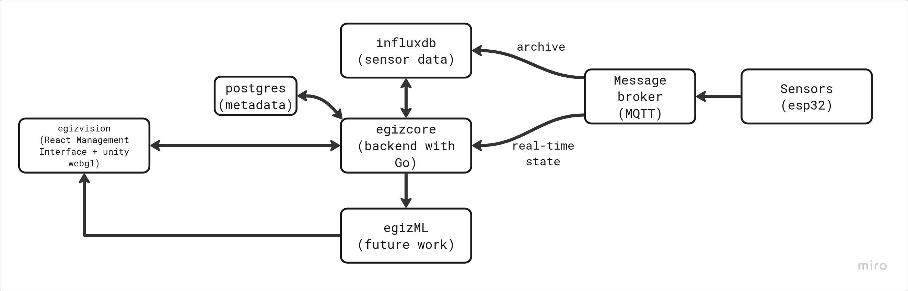
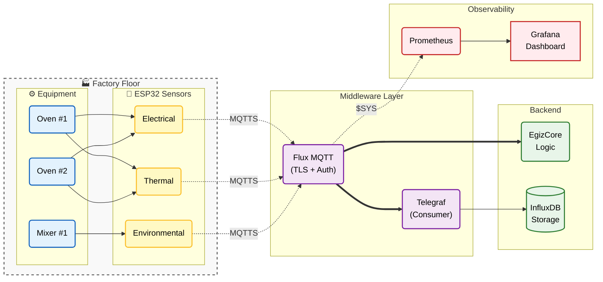

# PRD: Message Broker & Sensors — Edge Data Infrastructure

## Overview

The Message Broker & Sensors layer forms the foundation of OpenEgiz's data pipeline. It encompasses ESP32-based edge sensors deployed on factory equipment and a production-ready MQTT message broker (Mosquitto) that routes telemetry data to EgizCore and archives it to InfluxDB via Telegraf.



---

## Problem Statement

Industrial IoT deployments require reliable, low-latency data transport from edge devices to the digital twin platform. The system must:

1. Collect **electrical, thermal, and environmental** data from factory equipment
2. Handle **10,000+ sensors** publishing at 1-10 Hz frequency
3. Guarantee **message delivery** with QoS levels
4. Archive **all telemetry** to InfluxDB for historical analysis
5. Support **secure, production-ready** deployment with monitoring

---

## Goals

| ID | Goal |
|----|------|
| **G-1** | Deploy production-ready Mosquitto MQTT broker with TLS and authentication |
| **G-2** | Design standardized sensor payload schema for all device types |
| **G-3** | Achieve **<50ms** edge-to-broker latency |
| **G-4** | Support **100,000+ msg/sec** broker throughput |
| **G-5** | Archive 100% of telemetry to InfluxDB via Telegraf |
| **G-6** | Provide monitoring and alerting for broker health |
| **G-7** | Enable OTA firmware updates for ESP32 devices |

---

## Scope

### In Scope

- ESP32 sensor firmware specification
- Sensor payload schema (JSON format)
- MQTT topic hierarchy design
- Mosquitto broker configuration (production)
- TLS/SSL certificate management
- Authentication and authorization (ACLs)
- Telegraf configuration for InfluxDB archival
- Broker monitoring and metrics
- Docker deployment configuration

### Out of Scope

- Physical sensor hardware selection (assumed ESP32)
- Factory network infrastructure
- InfluxDB cluster setup (separate PRD)
- EgizCore MQTT client (covered in EgizCore PRD)
- Sensor calibration procedures

---

## Architecture



---

## Sensor Types

### Electrical Sensors

Monitor power consumption and electrical health of equipment.

| Measurement | Unit | Sampling Rate | Precision |
|-------------|------|---------------|-----------|
| Voltage (3-phase) | V | 1 Hz | ±0.5V |
| Current (3-phase) | A | 1 Hz | ±0.1A |
| Power Factor | - | 1 Hz | ±0.01 |
| Active Power | kW | 1 Hz | ±0.1kW |
| Energy | kWh | 1 Hz | ±0.01kWh |
| Frequency | Hz | 1 Hz | ±0.1Hz |

### Thermal Sensors

Monitor temperature across equipment zones.

| Measurement | Unit | Sampling Rate | Precision |
|-------------|------|---------------|-----------|
| Temperature | °C | 1 Hz | ±0.5°C |
| Setpoint | °C | On change | ±0.1°C |
| Heating Element Status | bool | On change | - |

### Environmental Sensors

Monitor ambient conditions in the factory.

| Measurement | Unit | Sampling Rate | Precision |
|-------------|------|---------------|-----------|
| Ambient Temperature | °C | 0.1 Hz | ±0.5°C |
| Humidity | %RH | 0.1 Hz | ±2% |
| Air Pressure | hPa | 0.1 Hz | ±1hPa |
| CO2 Level | ppm | 0.1 Hz | ±50ppm |

---

## MQTT Topic Hierarchy

### Topic Structure

```
openegiz/{factory_id}/{equipment_type}/{equipment_id}/{sensor_type}/telemetry
openegiz/{factory_id}/{equipment_type}/{equipment_id}/{sensor_type}/status
openegiz/{factory_id}/{equipment_type}/{equipment_id}/command
```

### Examples

| Topic | Purpose |
|-------|---------|
| `openegiz/factory-a/oven/oven-001/electrical/telemetry` | Electrical readings from Oven #1 |
| `openegiz/factory-a/oven/oven-001/thermal/telemetry` | Temperature readings from Oven #1 |
| `openegiz/factory-a/mixer/mixer-001/electrical/telemetry` | Electrical readings from Mixer #1 |
| `openegiz/factory-a/environment/zone-a/ambient/telemetry` | Environmental readings Zone A |
| `openegiz/factory-a/oven/oven-001/status` | Device status (online/offline) |
| `openegiz/factory-a/oven/oven-001/command` | Commands to device (OTA, config) |

### Wildcards for Subscribers

| Subscriber | Topic Pattern |
|------------|---------------|
| EgizCore | `openegiz/+/+/+/+/telemetry` |
| Telegraf | `openegiz/#` |
| ML Service | `openegiz/+/+/+/electrical/telemetry` |

---

## Payload Schema

### Telemetry Payload (Electrical)

```json
{
  "device_id": "esp32-oven001-elec",
  "thing_id": "factory:oven-001",
  "timestamp": "2026-01-29T10:30:00.123Z",
  "sensor_type": "electrical",
  "measurements": {
    "voltage": {
      "a": 220.5,
      "b": 219.8,
      "c": 221.0,
      "unit": "V"
    },
    "current": {
      "a": 15.2,
      "b": 14.8,
      "c": 15.5,
      "unit": "A"
    },
    "power_factor": 0.92,
    "active_power": {
      "total": 45.2,
      "unit": "kW"
    },
    "frequency": 50.01
  },
  "metadata": {
    "firmware_version": "1.2.3",
    "rssi": -65,
    "uptime_seconds": 86400
  }
}
```

### Telemetry Payload (Thermal)

```json
{
  "device_id": "esp32-oven001-therm",
  "thing_id": "factory:oven-001",
  "timestamp": "2026-01-29T10:30:00.456Z",
  "sensor_type": "thermal",
  "measurements": {
    "temperature_zones": [
      {"zone": 1, "value": 185.0, "unit": "C"},
      {"zone": 2, "value": 190.0, "unit": "C"},
      {"zone": 3, "value": 188.5, "unit": "C"}
    ],
    "setpoint": 190.0,
    "heating_active": true
  },
  "metadata": {
    "firmware_version": "1.2.3",
    "rssi": -62
  }
}
```

### Telemetry Payload (Environmental)

```json
{
  "device_id": "esp32-zonea-env",
  "thing_id": "factory:zone-a",
  "timestamp": "2026-01-29T10:30:00.789Z",
  "sensor_type": "environmental",
  "measurements": {
    "ambient_temperature": {
      "value": 24.5,
      "unit": "C"
    },
    "humidity": {
      "value": 55.2,
      "unit": "%RH"
    },
    "pressure": {
      "value": 1013.25,
      "unit": "hPa"
    },
    "co2": {
      "value": 450,
      "unit": "ppm"
    }
  },
  "metadata": {
    "firmware_version": "1.1.0",
    "rssi": -70
  }
}
```

### Status Payload

```json
{
  "device_id": "esp32-oven001-elec",
  "status": "online",
  "timestamp": "2026-01-29T10:30:00Z",
  "diagnostics": {
    "free_heap": 45000,
    "wifi_reconnects": 2,
    "mqtt_reconnects": 0,
    "uptime_seconds": 86400,
    "firmware_version": "1.2.3"
  }
}
```

---

## Functional Requirements

### FR-1: ESP32 Sensor Firmware

| Requirement | Description |
|-------------|-------------|
| FR-1.1 | Connect to WiFi with WPA2-Enterprise support |
| FR-1.2 | Connect to MQTT broker with TLS (MQTTS on port 8883) |
| FR-1.3 | Authenticate using username/password or X.509 certificates |
| FR-1.4 | Publish telemetry at configurable intervals (1-60 seconds) |
| FR-1.5 | Use QoS 1 for telemetry, QoS 2 for status messages |
| FR-1.6 | Implement Last Will and Testament (LWT) for offline detection |
| FR-1.7 | Buffer messages during connectivity loss (max 1000 messages) |
| FR-1.8 | Support OTA firmware updates via MQTT command topic |
| FR-1.9 | Publish status heartbeat every 60 seconds |
| FR-1.10 | Synchronize time via NTP for accurate timestamps |

### FR-2: Mosquitto Broker Configuration

| Requirement | Description |
|-------------|-------------|
| FR-2.1 | Enable TLS with Let's Encrypt or internal CA certificates |
| FR-2.2 | Configure listener on port 8883 (MQTTS) |
| FR-2.3 | Disable anonymous access |
| FR-2.4 | Implement password-based authentication with hashed passwords |
| FR-2.5 | Configure ACLs to restrict topic access per device/service |
| FR-2.6 | Set max inflight messages to 100 per client |
| FR-2.7 | Configure message size limit (256KB max) |
| FR-2.8 | Enable persistence for QoS 1/2 messages |
| FR-2.9 | Configure session expiry (24 hours) |
| FR-2.10 | Enable $SYS topic publishing for monitoring |

### FR-3: Access Control Lists (ACLs)

| Client Type | Read Topics | Write Topics |
|-------------|-------------|--------------|
| ESP32 Sensors | `openegiz/+/+/{device}/command` | `openegiz/+/+/{device}/+/telemetry`, `openegiz/+/+/{device}/status` |
| EgizCore | `openegiz/#` | `openegiz/+/+/+/command` |
| Telegraf | `openegiz/#` | - |
| ML Service | `openegiz/+/+/+/+/telemetry` | - |

### FR-4: Telegraf Configuration

| Requirement | Description |
|-------------|-------------|
| FR-4.1 | Subscribe to `openegiz/#` topic |
| FR-4.2 | Parse JSON payloads with proper field types |
| FR-4.3 | Extract tags: factory_id, equipment_type, equipment_id, sensor_type |
| FR-4.4 | Write to InfluxDB with batch size 5000, flush interval 1s |
| FR-4.5 | Handle backpressure with buffer of 100,000 metrics |
| FR-4.6 | Tag measurements with device_id and thing_id |

### FR-5: Monitoring and Alerting

| Requirement | Description |
|-------------|-------------|
| FR-5.1 | Expose Mosquitto metrics via $SYS topics |
| FR-5.2 | Configure Prometheus to scrape broker metrics |
| FR-5.3 | Create Grafana dashboard for broker health |
| FR-5.4 | Alert on: broker down, message queue > 10,000, client disconnects |
| FR-5.5 | Log all authentication failures |
| FR-5.6 | Monitor per-topic message rates |

---

## Non-Functional Requirements

| ID | Requirement | Target |
|----|-------------|--------|
| NFR-1 | Edge-to-broker latency | **<50ms** (same network) |
| NFR-2 | Broker throughput | **100,000+ msg/sec** |
| NFR-3 | Concurrent connections | **10,000+ clients** |
| NFR-4 | Message delivery guarantee | **99.99%** (QoS 1) |
| NFR-5 | Broker availability | **99.9%** |
| NFR-6 | TLS handshake time | **<500ms** |
| NFR-7 | Message retention (InfluxDB) | **90 days** raw, **1 year** aggregated |
| NFR-8 | Sensor battery life (if applicable) | **>1 year** |

---

## Security Requirements

| ID | Requirement |
|----|-------------|
| SEC-1 | TLS 1.3 for all MQTT connections |
| SEC-2 | X.509 client certificates for sensors (recommended) |
| SEC-3 | Password hashing using PBKDF2 |
| SEC-4 | ACL enforcement for all topic access |
| SEC-5 | Rate limiting: 100 msg/sec per client |
| SEC-6 | Audit logging for authentication events |
| SEC-7 | Certificate rotation every 90 days |
| SEC-8 | Secure firmware update verification (signed binaries) |

---

## Technical Stack

| Component | Technology | Rationale |
|-----------|------------|-----------|
| Microcontroller | **ESP32-WROOM-32** | WiFi, low power, Arduino/ESP-IDF |
| MQTT Broker | **Mosquitto 2.x** | Lightweight, proven, MQTT 5.0 |
| Data Archiver | **Telegraf** | Native MQTT input, InfluxDB output |
| Time-Series DB | **InfluxDB 2.x** | Optimized for telemetry |
| Monitoring | **Prometheus + Grafana** | Industry standard |
| Certificates | **Let's Encrypt / Internal CA** | Automated renewal |

### Directory Structure

```
message-broker/
├── mosquitto/
│   ├── config/
│   │   ├── mosquitto.conf
│   │   ├── acl.conf
│   │   └── passwd
│   ├── certs/
│   │   ├── ca.crt
│   │   ├── server.crt
│   │   └── server.key
│   └── Dockerfile
├── telegraf/
│   ├── telegraf.conf
│   └── Dockerfile
├── esp32-firmware/
│   ├── src/
│   │   ├── main.cpp
│   │   ├── mqtt_client.cpp
│   │   ├── sensors/
│   │   │   ├── electrical.cpp
│   │   │   ├── thermal.cpp
│   │   │   └── environmental.cpp
│   │   └── ota.cpp
│   ├── platformio.ini
│   └── README.md
├── monitoring/
│   ├── prometheus.yml
│   └── grafana/
│       └── dashboards/
├── docker-compose.yml
└── README.md
```

---

## Implementation Plan

### Phase 1: Broker Setup (Week 1)

| Step | Task |
|------|------|
| 1.1 | Install and configure Mosquitto with TLS |
| 1.2 | Generate certificates (internal CA for dev) |
| 1.3 | Configure authentication and ACLs |
| 1.4 | Create Docker container for Mosquitto |
| 1.5 | Test with MQTT.fx or mosquitto_pub/sub |
| 1.6 | Document configuration |

### Phase 2: Telegraf Integration (Week 1)

| Step | Task |
|------|------|
| 2.1 | Configure Telegraf MQTT consumer |
| 2.2 | Define InfluxDB measurement schema |
| 2.3 | Test end-to-end: MQTT → Telegraf → InfluxDB |
| 2.4 | Verify data in InfluxDB |
| 2.5 | Create docker-compose.yml with all services |

### Phase 3: ESP32 Firmware (Week 2)

| Step | Task |
|------|------|
| 3.1 | Create PlatformIO project |
| 3.2 | Implement WiFi connection with reconnection |
| 3.3 | Implement MQTT client with TLS |
| 3.4 | Implement sensor reading modules |
| 3.5 | Implement JSON payload serialization |
| 3.6 | Implement LWT and status publishing |
| 3.7 | Implement OTA update mechanism |
| 3.8 | Test with real hardware |

### Phase 4: Monitoring (Week 2)

| Step | Task |
|------|------|
| 4.1 | Configure Prometheus to scrape Mosquitto |
| 4.2 | Create Grafana dashboard |
| 4.3 | Configure alerts |
| 4.4 | Document operational procedures |

---

## Verification Plan

### Automated Tests

| Test | Command/Method |
|------|----------------|
| Broker health | `mosquitto_sub -t '$SYS/#'` |
| TLS verification | `openssl s_client -connect broker:8883` |
| ACL enforcement | Attempt unauthorized topic access |
| Telegraf parsing | Check InfluxDB for correct schema |

### Manual Verification

- [ ] ESP32 connects to broker with TLS
- [ ] Telemetry appears in InfluxDB within 2 seconds
- [ ] Device offline detected via LWT within 30 seconds
- [ ] OTA update completes successfully
- [ ] Grafana dashboard shows real-time metrics
- [ ] Alerts trigger on simulated failure

### Load Testing

| Scenario | Target |
|----------|--------|
| 1,000 concurrent sensors | Broker CPU <50% |
| 50,000 msg/sec sustained | No message loss |
| Broker restart | Clients reconnect within 10s |

---

## Open Questions

1. **Certificate Management**: Use internal CA or Let's Encrypt for production?
2. **ESP32 Power**: Are sensors battery-powered or always-on (affects sampling rate)?
3. **Network Topology**: Direct WiFi or via industrial gateways?
4. **Firmware Updates**: Central OTA server or per-device update?
5. **Data Compression**: Enable payload compression for bandwidth savings?

---

## Dependencies

| Dependency | Owner | Status |
|------------|-------|--------|
| Network infrastructure | IT Team | Required |
| InfluxDB setup | DevOps | In progress |
| ESP32 hardware procurement | Hardware Team | Required |
| EgizCore MQTT client | EgizCore Team | Dependent |

---

## Revision History

| Date | Version | Author | Changes |
|------|---------|--------|---------|
| 2026-01-29 | 1.0 | AI | Initial Message Broker & Sensors PRD |
