# OpenEgiz — Master Product Requirements Document

## Industrial Digital Twin Platform for Food Production

**Version:** 1.0  
**Date:** 2026-01-29  
**Status:** Draft


---

## Executive Summary

OpenEgiz is an open-source Industrial Digital Twin platform purpose-built for food production facilities. It provides real-time monitoring, 3D visualization, and AI-powered anomaly detection for factory equipment such as ovens, mixers, and conveyors.

The platform ingests sensor data from ESP32 edge devices, maintains a live digital representation of all equipment, visualizes the factory in immersive 3D (WebGL and VR), and uses machine learning to detect anomalies and predict maintenance needs.

### Key Differentiators

| Feature | OpenEgiz | Traditional SCADA | Eclipse Ditto |
|---------|----------|-------------------|---------------|
| 3D Visualization | Immersive WebGL + VR | 2D diagrams | None |
| ML Anomaly Detection | Built-in, real-time | Manual thresholds | External |
| Latency | <200ms end-to-end | Seconds | 500ms+ |
| Resource Footprint | <2GB total | Heavy | 8GB+ |
| Customization | Purpose-built for food | Generic | Complex |
| Open Source | Yes | No | Yes |

---

## Vision & Goals

### Vision Statement

> Enable food production facilities to achieve **zero unplanned downtime** through real-time digital twins, immersive visualization, and predictive AI.

### Platform Goals

| ID | Goal | Success Metric |
|----|------|----------------|
| **PG-1** | Real-time visibility into all equipment | <200ms sensor-to-screen latency |
| **PG-2** | Predictive maintenance | 24-72 hour failure prediction |
| **PG-3** | Intuitive operator experience | 3D + VR visualization, no training required |
| **PG-4** | Reduce unplanned downtime | 50% reduction in Year 1 |
| **PG-5** | Open-source, extensible platform | Active community, plugin architecture |
| **PG-6** | Production-ready deployment | 99.9% availability, Docker-based |

---

## System Architecture

### High-Level Overview

```mermaid
%%{init: {'theme': 'base', 'themeVariables': { 'primaryColor': '#ffffff', 'edgeLabelBackground':'#ffffff', 'tertiaryColor': '#F0F0F0'}}}%%
flowchart LR
    %% GLOBAL STYLES
    classDef edgeLayer fill:#e3f2fd,stroke:#1565c0,stroke-width:2px,color:#000
    classDef brokerLayer fill:#e8f5e9,stroke:#2e7d32,stroke-width:2px,color:#000
    classDef coreLayer fill:#fff3e0,stroke:#ef6c00,stroke-width:2px,color:#000
    classDef storageLayer fill:#f3e5f5,stroke:#7b1fa2,stroke-width:2px,color:#000
    classDef vizLayer fill:#fce4ec,stroke:#c2185b,stroke-width:2px,color:#000
    
    %% NODES
    subgraph Edge ["📡 Edge Layer"]
        direction TB
        ESP32("fa:fa-microchip ESP32 Sensors<br/>(Electrical, Thermal)"):::edgeLayer
    end
    
    subgraph Msg ["📨 Message Broker"]
        direction TB
        MQTT("fa:fa-envelope Mosquitto MQTT<br/>(TLS + Auth)"):::brokerLayer
        Telegraf("fa:fa-satellite-dish Telegraf<br/>(Archiver)"):::brokerLayer
    end
    
    subgraph Core ["🧠 Core Platform"]
        EgizCore("fa:fa-server EgizCore<br/>(Go Digital Twin)"):::coreLayer
    end
    
    subgraph Storage ["💾 Storage Layer"]
        direction TB
        InfluxDB[("fa:fa-database InfluxDB<br/>(Time-Series)")]:::storageLayer
        Grafana("fa:fa-chart-area Grafana<br/>(Dashboards)"):::storageLayer
    end
    
    subgraph Intel ["🤖 Intelligence"]
        EgizML("fa:fa-brain EgizML<br/>(Python Service)"):::vizLayer
    end
    
    subgraph Vis ["🖥️ Visualization & Biz"]
        direction TB
        EgizVision("fa:fa-cube EgizVision<br/>(Unity 3D)"):::vizLayer
        Mendix("fa:fa-briefcase Mendix<br/>(Business Apps)"):::vizLayer
    end

    %% CONNECTIONS
    ESP32 -->|"MQTTS"| MQTT
    MQTT --> EgizCore
    MQTT --> Telegraf
    Telegraf --> InfluxDB
    
    EgizCore <-->|"REST"| InfluxDB
    EgizCore -->|"WebSocket"| EgizVision
    EgizCore -->|"WebSocket"| EgizML
    EgizCore <-->|"REST"| Mendix
    
    EgizML -.->|"Anomaly Events"| EgizCore
    InfluxDB --> EgizML
    InfluxDB --> Grafana

    %% LAYOUT HELPERS
    linkStyle default stroke:#666,stroke-width:1px,fill:none;
```



### Data Flow

```
┌─────────────┐    ┌─────────────┐    ┌─────────────┐    ┌─────────────┐
│   ESP32     │    │  Mosquitto  │    │  EgizCore   │    │ EgizVision  │
│   Sensors   │───▶│    MQTT     │───▶│  (Go)       │───▶│  (Unity)    │
│             │    │             │    │             │    │             │
└─────────────┘    └──────┬──────┘    └──────┬──────┘    └─────────────┘
                          │                  │
                          ▼                  ▼
                   ┌─────────────┐    ┌─────────────┐
                   │  Telegraf   │    │   EgizML    │
                   │             │    │  (Python)   │
                   └──────┬──────┘    └──────┬──────┘
                          │                  │
                          ▼                  │
                   ┌─────────────┐           │
                   │  InfluxDB   │◀──────────┘
                   │             │
                   └─────────────┘
```

### Latency Budget

| Hop | Component | Target | Cumulative |
|-----|-----------|--------|------------|
| 1 | Sensor → MQTT Broker | <50ms | 50ms |
| 2 | MQTT → EgizCore | <20ms | 70ms |
| 3 | EgizCore Processing | <30ms | 100ms |
| 4 | WebSocket → EgizVision | <50ms | 150ms |
| 5 | Unity Render | <50ms | **200ms** |

---

## Platform Components

### 1. Message Broker & Sensors

**Purpose:** Edge data collection and transport infrastructure.

| Aspect | Specification |
|--------|---------------|
| **Hardware** | ESP32-WROOM-32 microcontrollers |
| **Sensors** | Electrical (voltage, current, power), Thermal (temperature zones), Environmental (humidity, CO2) |
| **Protocol** | MQTT 5.0 with TLS 1.3 |
| **Broker** | Mosquitto 2.x |
| **Archival** | Telegraf → InfluxDB |
| **Throughput** | 100,000+ msg/sec |
| **Latency** | <50ms edge-to-broker |

**Key Features:**
- Standardized JSON payload schema for all sensor types
- Hierarchical topic structure: `openegiz/{factory}/{equipment_type}/{equipment_id}/{sensor_type}/telemetry`
- QoS 1 for telemetry, QoS 2 for critical status
- Last Will and Testament for offline detection
- OTA firmware updates via MQTT

📄 **Detailed PRD:** [prd-message-broker-sensors.md](prd-message-broker-sensors.md)

---

### 2. EgizCore — Digital Twin Engine

**Purpose:** Central state management and API gateway for all consumers.

| Aspect | Specification |
|--------|---------------|
| **Language** | Go 1.25.6 |
| **State Store** | In-memory with mutex protection |
| **Capacity** | 10,000+ Things |
| **APIs** | REST (CRUD, queries), WebSocket (subscriptions) |
| **Integrations** | MQTT (ingestion), InfluxDB (history proxy) |
| **Throughput** | 100,000+ updates/sec |
| **Latency** | <200ms sensor-to-WebSocket |

**Thing Model:**
```go
type Thing struct {
    ID           string                 // "factory:oven-001"
    Type         string                 // "oven", "mixer"
    Metadata     map[string]any         // Static: name, location
    Features     map[string]Feature     // Dynamic: electrical, thermal
    Relationships []Relationship        // Links to other Things
    Version      int64                  // Optimistic concurrency
    LastUpdated  time.Time
}
```

**Key Features:**
- Partial feature updates without replacing entire Thing
- Event bus for internal pub/sub
- WebSocket subscriptions by Thing ID or filter
- InfluxDB proxy for historical queries
- OpenTelemetry observability

📄 **Detailed PRD:** [prd-egizcore.md](prd-egizcore.md)

---

### 3. EgizVision — 3D Visualization

**Purpose:** Immersive visualization of factory digital twins.

| Aspect | Specification |
|--------|---------------|
| **Engine** | Unity 2022 LTS |
| **Platforms** | WebGL (browser), Meta Quest, Apple Vision Pro |
| **Frame Rate** | 60 FPS (WebGL), 72 FPS (VR) |
| **Data Source** | EgizCore WebSocket + REST |
| **Capacity** | 500+ Things rendered |
| **Bundle Size** | <50MB (WebGL compressed) |

**Visualization Features:**
- Real-time sensor data overlays (heatmaps, gauges)
- Color-coded equipment status (green/yellow/red)
- Anomaly highlighting with pulsing effects
- Historical timeline with playback controls
- VR walkthrough with hand tracking

**User Personas:**
| Persona | Primary Use | Platform |
|---------|-------------|----------|
| Factory Operator | Real-time monitoring | WebGL (control room) |
| Maintenance Engineer | Historical analysis, diagnostics | WebGL + VR |
| Plant Manager | KPI dashboard, factory tours | WebGL + VR |

📄 **Detailed PRD:** [prd-egizvision.md](prd-egizvision.md)

---

### 4. EgizML — Machine Learning Service

**Purpose:** Real-time anomaly detection and predictive maintenance.

| Aspect | Specification |
|--------|---------------|
| **Language** | Python 3.11 |
| **Framework** | FastAPI + PyTorch |
| **Detection Latency** | <100ms (p99) |
| **Precision** | >95% |
| **Prediction Horizon** | 24-72 hours |
| **Throughput** | 100,000+ points/sec |

**Hybrid Detection Approach:**

| Tier | Method | Latency | Use Case |
|------|--------|---------|----------|
| 1 | Rule-Based | <1ms | Known failure modes, thresholds |
| 2 | Statistical | <10ms | Z-score, EWMA, seasonal patterns |
| 3 | ML Models | <100ms | Isolation Forest, LSTM, Transformer |

**Predictive Models:**
- **Isolation Forest**: Real-time multi-variate anomaly detection
- **LSTM**: 24-72 hour RUL (Remaining Useful Life) prediction
- **Transformer**: 7-day failure probability forecasting

**Key Features:**
- YAML-configurable detection rules
- Explainable anomaly reasons
- MLflow experiment tracking
- Continuous learning from operator feedback
- Prometheus metrics

📄 **Detailed PRD:** [prd-egizml.md](prd-egizml.md)

---

### 5. Storage & Observability

**Purpose:** Time-series storage, dashboards, and monitoring.

| Component | Technology | Purpose |
|-----------|------------|---------|
| **InfluxDB 2.x** | Time-series database | Sensor telemetry storage |
| **Grafana** | Dashboard platform | Operational dashboards |
| **Prometheus** | Metrics collection | System monitoring |
| **OpenTelemetry** | Observability | Traces, metrics, logs |

**Data Retention:**
- Raw telemetry: 90 days
- Aggregated (hourly): 1 year
- Aggregated (daily): 5 years

---

## Integration Points

### API Contracts

| Integration | Protocol | Direction | Purpose |
|-------------|----------|-----------|---------|
| ESP32 → MQTT | MQTTS | Publish | Sensor telemetry |
| MQTT → EgizCore | MQTT | Subscribe | Ingestion |
| MQTT → Telegraf | MQTT | Subscribe | Archival |
| EgizCore → InfluxDB | HTTP | Query | Historical data |
| EgizCore → EgizVision | WebSocket | Push | Real-time updates |
| EgizCore → EgizML | WebSocket | Push | Live data for detection |
| EgizML → EgizCore | REST | Push | Anomaly events |
| Mendix → EgizCore | REST | Request | Business integration |

### WebSocket Message Format

**Subscribe:**
```json
{"action": "subscribe", "thingId": "factory:oven-001"}
```

**State Change Event:**
```json
{
  "event": "StateChanged",
  "thingId": "factory:oven-001",
  "feature": "electrical",
  "properties": {"voltage": {"a": 221.0}},
  "version": 1235,
  "timestamp": "2026-01-29T10:30:05Z"
}
```

**Anomaly Event:**
```json
{
  "event": "AnomalyDetected",
  "thingId": "factory:oven-001",
  "anomalyType": "overtemperature",
  "severity": "critical",
  "confidence": 0.95,
  "explanation": "Zone 2 temperature exceeds maximum"
}
```

---

## Non-Functional Requirements

### Performance

| Metric | Target |
|--------|--------|
| End-to-end latency | <200ms |
| MQTT throughput | 100,000+ msg/sec |
| WebSocket clients | 1,000+ concurrent |
| Thing capacity | 10,000+ |
| Frame rate (WebGL) | 60 FPS |
| ML inference latency | <100ms |

### Reliability

| Metric | Target |
|--------|--------|
| Platform availability | 99.9% |
| Message delivery (QoS 1) | 99.99% |
| Data retention | 90 days raw, 1 year aggregated |

### Scalability

| Dimension | MVP | Scale Target |
|-----------|-----|--------------|
| Sensors | 100 | 10,000+ |
| Things | 100 | 10,000+ |
| Factories | 1 | 10+ |
| Concurrent users | 10 | 100+ |

### Security (Phase 2)

| Requirement | Implementation |
|-------------|----------------|
| Transport | TLS 1.3 everywhere |
| Authentication | JWT (users), API keys (M2M), X.509 (sensors) |
| Authorization | ACL for MQTT, RBAC for REST |
| Secrets | Vault or environment variables |
| Audit | Centralized logging |

---

## Technology Stack Summary

| Layer | Component | Technology |
|-------|-----------|------------|
| **Edge** | Sensors | ESP32-WROOM-32, PlatformIO |
| **Broker** | MQTT | Mosquitto 2.x |
| **Archiver** | Telegraf | Telegraf |
| **Core** | Digital Twin Engine | Go 1.25.6, Chi, Gorilla WebSocket |
| **Storage** | Time-Series | InfluxDB 2.x |
| **ML** | Anomaly Detection | Python 3.11, FastAPI, PyTorch |
| **Visualization** | 3D Client | Unity 2022 LTS, C# |
| **Monitoring** | Dashboards | Grafana, Prometheus |
| **Deployment** | Containers | Docker, docker-compose |

---

## Project Structure

```
openegiz/
├── README.md
├── LICENSE
├── docker-compose.yml              # Full stack deployment
├── docs/
│   ├── architecture.md
│   ├── api-reference.md
│   └── deployment-guide.md
│
├── prd-egizcore.md                 # EgizCore PRD
├── prd-message-broker-sensors.md   # Message Broker & Sensors PRD
├── prd-egizvision.md               # EgizVision PRD
├── prd-egizml.md                   # EgizML PRD
│
├── egizcore/                       # Go Digital Twin Engine
│   ├── cmd/
│   ├── internal/
│   ├── api/
│   ├── Dockerfile
│   └── go.mod
│
├── message-broker/                 # MQTT Infrastructure
│   ├── mosquitto/
│   ├── telegraf/
│   ├── esp32-firmware/
│   └── docker-compose.yml
│
├── egizml/                         # Python ML Service
│   ├── src/
│   ├── configs/
│   ├── models/
│   ├── Dockerfile
│   └── requirements.txt
│
├── egizvision/                     # Unity 3D Client
│   ├── Assets/
│   ├── Packages/
│   ├── ProjectSettings/
│   └── Builds/
│
└── infrastructure/                 # Deployment configs
    ├── grafana/
    ├── prometheus/
    └── influxdb/
```

---

## Implementation Roadmap

### Phase 1: Foundation (Weeks 1-2)

| Week | Component | Deliverable |
|------|-----------|-------------|
| 1 | Message Broker | Mosquitto + Telegraf deployed, TLS configured |
| 1 | EgizCore | Thing model, registry, in-memory state store |
| 2 | Message Broker | ESP32 firmware, sensor payloads |
| 2 | EgizCore | MQTT client, REST API, WebSocket API |

**Milestone:** Sensor data flows through MQTT → EgizCore → InfluxDB

### Phase 2: Intelligence (Weeks 3-4)

| Week | Component | Deliverable |
|------|-----------|-------------|
| 3 | EgizML | Rule engine, statistical detection |
| 3 | EgizML | WebSocket client, anomaly publishing |
| 4 | EgizML | Isolation Forest, ensemble combiner |
| 4 | EgizML | REST API, Prometheus metrics |

**Milestone:** Real-time anomaly detection operational

### Phase 3: Visualization (Weeks 5-6)

| Week | Component | Deliverable |
|------|-----------|-------------|
| 5 | EgizVision | Unity project, WebSocket client, data models |
| 5 | EgizVision | Factory scene, equipment rendering |
| 6 | EgizVision | Sensor overlays, anomaly VFX |
| 6 | EgizVision | WebGL build, browser deployment |

**Milestone:** 3D visualization in browser with live data

### Phase 4: Enhancement (Weeks 7-8)

| Week | Component | Deliverable |
|------|-----------|-------------|
| 7 | EgizVision | Historical playback, timeline control |
| 7 | EgizML | LSTM predictor, RUL API |
| 8 | EgizVision | VR build (Meta Quest) |
| 8 | All | Performance optimization, load testing |

**Milestone:** Predictive maintenance + VR support

### Phase 5: Production (Weeks 9-10)

| Week | Component | Deliverable |
|------|-----------|-------------|
| 9 | All | Security hardening, TLS everywhere |
| 9 | All | Grafana dashboards, alerting |
| 10 | All | Documentation, deployment guide |
| 10 | All | Production deployment |

**Milestone:** Production-ready platform

---

## Success Metrics

### Technical KPIs

| Metric | Target | Measurement |
|--------|--------|-------------|
| End-to-end latency (p99) | <200ms | OpenTelemetry |
| System availability | 99.9% | Uptime monitoring |
| Anomaly precision | >95% | Model evaluation |
| False positive rate | <5% | Operator feedback |
| WebGL frame rate | 60 FPS | Unity Profiler |

### Business KPIs

| Metric | Baseline | Target (Year 1) |
|--------|----------|-----------------|
| Unplanned downtime | 100 hours/year | 50 hours/year |
| Mean time to detect | 30 minutes | <5 minutes |
| Mean time to repair | 4 hours | 2 hours |
| Energy waste reduction | - | 10% |

---

## Risk Assessment

| Risk | Impact | Likelihood | Mitigation |
|------|--------|------------|------------|
| Sensor connectivity issues | High | Medium | Redundant WiFi, message buffering |
| ML false positives | Medium | Medium | Hybrid approach, operator feedback loop |
| WebGL performance on low-end devices | Medium | Low | Adaptive quality, LOD |
| VR motion sickness | Low | Low | Teleportation locomotion |
| Data volume exceeds storage | Medium | Low | Retention policies, aggregation |

---

## Open Questions (Platform-Wide)

1. **Multi-tenancy:** How do we isolate data between factories/customers?
2. **Authentication:** Unified auth system or per-component?
3. **Deployment:** On-premise, cloud, or hybrid?
4. **Pricing Model:** Open-source core + enterprise features?
5. **Community:** How do we build an open-source community?

---

## Team Structure

| Role | Responsibility | Allocation |
|------|----------------|------------|
| **Platform Lead** | Architecture, integration | 1 FTE |
| **Backend Engineer** | EgizCore (Go) | 1 FTE |
| **ML Engineer** | EgizML (Python) | 1 FTE |
| **Unity Developer** | EgizVision | 1 FTE |
| **Embedded Engineer** | ESP32 firmware | 0.5 FTE |
| **DevOps** | Infrastructure, CI/CD | 0.5 FTE |

---

## Related Documents

| Document | Description |
|----------|-------------|
| [prd-egizcore.md](prd-egizcore.md) | EgizCore Digital Twin Engine PRD |
| [prd-message-broker-sensors.md](prd-message-broker-sensors.md) | Message Broker & Sensors PRD |
| [prd-egizvision.md](prd-egizvision.md) | EgizVision 3D Visualization PRD |
| [prd-egizml.md](prd-egizml.md) | EgizML Machine Learning Service PRD |

---

## Revision History

| Date | Version | Author | Changes |
|------|---------|--------|---------|
| 2026-01-29 | 1.0 | AI | Initial Master PRD |

---

## Appendix A: Glossary

| Term | Definition |
|------|------------|
| **Thing** | Digital representation of a physical asset (oven, mixer, etc.) |
| **Feature** | A capability or sensor group within a Thing (electrical, thermal) |
| **Digital Twin** | Virtual replica synchronized with physical equipment |
| **RUL** | Remaining Useful Life - predicted time until maintenance needed |
| **QoS** | Quality of Service - MQTT message delivery guarantee level |
| **LWT** | Last Will and Testament - MQTT offline notification |

## Appendix B: Equipment Types

| Type | Description | Sensors |
|------|-------------|---------|
| **Oven** | Industrial baking oven | Electrical, Thermal (multi-zone) |
| **Mixer** | Dough mixing equipment | Electrical, Vibration |
| **Conveyor** | Product transport belt | Electrical, Speed |
| **Proofer** | Dough proofing chamber | Thermal, Environmental |
| **Cooler** | Cooling tunnel | Thermal, Environmental |

## Appendix C: Deployment Topology

```
┌─────────────────────────────────────────────────────────────────────┐
│                        Production Environment                        │
├─────────────────────────────────────────────────────────────────────┤
│                                                                     │
│  ┌─────────────┐  ┌─────────────┐  ┌─────────────┐                │
│  │  Mosquitto  │  │  EgizCore   │  │   EgizML    │                │
│  │   (MQTT)    │  │    (Go)     │  │  (Python)   │                │
│  │   :8883     │  │   :8080     │  │   :8000     │                │
│  └──────┬──────┘  └──────┬──────┘  └──────┬──────┘                │
│         │                │                │                        │
│         └────────────────┼────────────────┘                        │
│                          │                                          │
│  ┌─────────────┐  ┌──────┴──────┐  ┌─────────────┐                │
│  │  InfluxDB   │  │   Traefik   │  │   Grafana   │                │
│  │   :8086     │  │  (Reverse)  │  │   :3000     │                │
│  └─────────────┘  │   :443      │  └─────────────┘                │
│                   └─────────────┘                                   │
│                                                                     │
└─────────────────────────────────────────────────────────────────────┘
                              │
                              │ HTTPS
                              ▼
                    ┌─────────────────┐
                    │   EgizVision    │
                    │    (WebGL)      │
                    │    Browser      │
                    └─────────────────┘
```
