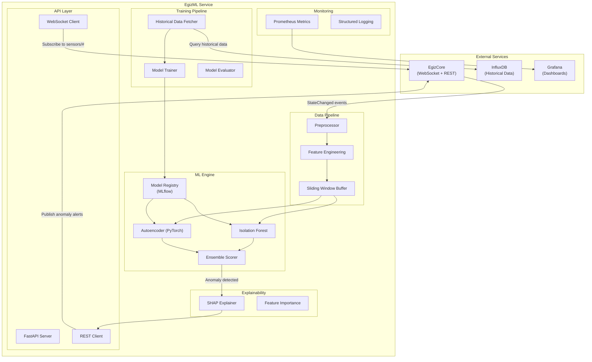

# PRD: EgizML — Machine Learning Anomaly Detection Service

## Overview

EgizML is a **Python-based machine learning service** that performs real-time anomaly detection on industrial sensor data. It connects to EgizCore via WebSocket to receive live telemetry, applies trained models to detect abnormal patterns (voltage spikes, temperature drift, power factor degradation), and publishes anomaly alerts back to EgizCore for visualization and business system integration.


---

## Problem Statement

Industrial equipment failures are costly and often preventable. Traditional threshold-based monitoring (e.g., "alert if temperature > 200°C") fails to detect:

1. **Gradual degradation** — Slow drift in power factor over days/weeks
2. **Multi-variate patterns** — Voltage imbalance combined with current asymmetry
3. **Contextual anomalies** — Normal values during wrong production phase
4. **Early warning signs** — Subtle changes that precede catastrophic failure

OpenEgiz requires an **ML-powered anomaly detection system** that:

- Learns normal operational patterns from historical data
- Detects anomalies in real-time (<5s latency from sensor reading)
- Adapts to changing production conditions (different recipes, seasonal effects)
- Provides explainability (which features contributed to anomaly score)
- Integrates seamlessly with EgizCore and EgizVision

---

## Goals

| ID | Goal |
|----|------|
| **G-1** | Build Python service using FastAPI for REST API and WebSocket client |
| **G-2** | Implement unsupervised anomaly detection (Isolation Forest, Autoencoder) |
| **G-3** | Achieve **<5s** end-to-end latency (sensor → ML → alert) |
| **G-4** | Train models on historical InfluxDB data (30-day rolling window) |
| **G-5** | Provide explainability: top 3 contributing features per anomaly |
| **G-6** | Support multiple model types per equipment class (oven, mixer, etc.) |
| **G-7** | Deploy as Docker container with model versioning |
| **G-8** | Expose metrics and model performance dashboards (Grafana) |

---

## Scope

### In Scope

**Core Features:**
- WebSocket client to subscribe to EgizCore state updates
- REST API client to fetch historical data from EgizCore/InfluxDB
- Data preprocessing pipeline (normalization, feature engineering)
- Model training pipeline (offline batch training)
- Real-time inference engine (online anomaly scoring)
- Anomaly alerting (publish back to EgizCore via REST API)
- Model versioning and storage (MLflow or similar)
- Explainability (SHAP values for feature importance)
- Health monitoring and metrics (Prometheus)

**ML Models (MVP):**
- **Isolation Forest** — Baseline unsupervised model
- **Autoencoder** — Deep learning for complex patterns
- **Statistical Control** — Z-score, moving average (fallback)

**Supported Equipment Types:**
- Ovens (electrical + thermal features)
- Mixers (electrical + vibration features)
- Conveyors (electrical + speed features)

**API Endpoints:**
- `POST /train/{thing_id}` — Train model for specific equipment
- `GET /models` — List all trained models
- `GET /anomalies/{thing_id}` — Get recent anomalies
- `GET /health` — Service health check
- `GET /metrics` — Prometheus metrics

### Out of Scope

- Predictive maintenance (RUL prediction) — Phase 2
- Root cause analysis automation — Phase 2
- Multi-step forecasting (predict next 1 hour) — Phase 3
- Supervised learning (requires labeled failure data) — Phase 2
- Edge inference (run ML on ESP32) — Phase 3
- Custom model upload via UI — Phase 2
- A/B testing of model versions — Phase 2

---

## Architecture



---

## User Stories

### US-001: Connect to EgizCore
**Description:** As a developer, I need EgizML to connect to EgizCore so it can receive live sensor data.

**Acceptance Criteria:**
- [ ] WebSocket client connects to EgizCore on startup
- [ ] Subscribe to all Things with type "oven", "mixer", "conveyor"
- [ ] Parse incoming `StateChanged` events
- [ ] Log connection status and errors
- [ ] Auto-reconnect with exponential backoff
- [ ] Typecheck passes
- [ ] Unit tests for WebSocket client

### US-002: Fetch Historical Data for Training
**Description:** As a data scientist, I want to fetch 30 days of historical sensor data so I can train anomaly detection models.

**Acceptance Criteria:**
- [ ] REST client queries InfluxDB via EgizCore proxy
- [ ] Fetch all features for a given Thing over specified time range
- [ ] Convert InfluxDB format to Pandas DataFrame
- [ ] Handle missing values (forward-fill or interpolate)
- [ ] Cache fetched data locally (Parquet files)
- [ ] Typecheck passes
- [ ] Integration test with mock InfluxDB data

### US-003: Train Isolation Forest Model
**Description:** As a developer, I want to train an Isolation Forest model on historical data to detect anomalies.

**Acceptance Criteria:**
- [ ] Load historical data for a Thing (30-day window)
- [ ] Extract electrical and thermal features
- [ ] Normalize features (StandardScaler)
- [ ] Train scikit-learn IsolationForest with contamination=0.01
- [ ] Evaluate on validation set (precision, recall, F1)
- [ ] Save trained model to MLflow registry
- [ ] Log training metrics (training time, model size, performance)
- [ ] Typecheck passes
- [ ] Unit tests for training pipeline

### US-004: Real-Time Anomaly Detection
**Description:** As an operator, I want EgizML to detect anomalies in real-time and alert me via EgizCore.

**Acceptance Criteria:**
- [ ] Receive `StateChanged` event from WebSocket
- [ ] Extract features (voltage, current, temperature, power_factor)
- [ ] Load trained model for Thing's equipment type from registry
- [ ] Compute anomaly score (Isolation Forest decision function)
- [ ] If score < threshold (-0.5), mark as anomaly
- [ ] Publish anomaly alert to EgizCore via REST: `PUT /api/v1/things/{id}/features/status`
- [ ] End-to-end latency < 5 seconds
- [ ] Typecheck passes
- [ ] Integration test with mock EgizCore

### US-005: Train Autoencoder Model
**Description:** As a data scientist, I want to train a deep learning autoencoder to detect complex multi-variate anomalies.

**Acceptance Criteria:**
- [ ] Load historical data (30-day window)
- [ ] Build PyTorch autoencoder (encoder: 10 → 5 → 2, decoder: 2 → 5 → 10)
- [ ] Train for 50 epochs with MSE loss
- [ ] Compute reconstruction error on validation set
- [ ] Set threshold at 95th percentile of validation errors
- [ ] Save model to MLflow registry
- [ ] Log training loss curve to Grafana
- [ ] Typecheck passes
- [ ] Unit tests for autoencoder architecture

### US-006: Ensemble Scoring
**Description:** As a developer, I want to combine Isolation Forest and Autoencoder scores for robust anomaly detection.

**Acceptance Criteria:**
- [ ] Compute Isolation Forest anomaly score (IF_score)
- [ ] Compute Autoencoder reconstruction error (AE_score)
- [ ] Normalize both scores to [0, 1] range
- [ ] Ensemble: final_score = 0.6 * IF_score + 0.4 * AE_score
- [ ] If final_score > 0.7, flag as anomaly
- [ ] Typecheck passes
- [ ] Unit tests for ensemble logic

### US-007: Explainability with SHAP
**Description:** As an operator, I want to know which sensor readings contributed to an anomaly alert.

**Acceptance Criteria:**
- [ ] Install SHAP library
- [ ] Compute SHAP values for Isolation Forest predictions
- [ ] Extract top 3 features with highest absolute SHAP values
- [ ] Include in anomaly alert payload: `{"top_features": ["voltage_a", "power_factor", "temperature_zone_1"]}`
- [ ] Display in EgizVision detail panel
- [ ] Typecheck passes
- [ ] Integration test for SHAP computation

### US-008: Model Versioning and Registry
**Description:** As a developer, I want to version trained models so I can roll back if performance degrades.

**Acceptance Criteria:**
- [ ] Use MLflow for model registry
- [ ] Tag models with: Thing ID, model type, training date, performance metrics
- [ ] Load latest model version on startup
- [ ] Expose REST endpoint: `GET /models` to list all models
- [ ] Support manual model switching: `POST /models/{model_id}/activate`
- [ ] Typecheck passes
- [ ] Integration test for MLflow registry

### US-009: Prometheus Metrics
**Description:** As a DevOps engineer, I want to monitor EgizML performance metrics in Grafana.

**Acceptance Criteria:**
- [ ] Expose Prometheus metrics endpoint: `/metrics`
- [ ] Track: inference_latency_seconds, anomalies_detected_total, model_load_time_seconds
- [ ] Track: websocket_connection_status (1 = connected, 0 = disconnected)
- [ ] Create Grafana dashboard with 4 panels: latency, anomaly rate, model accuracy, system health
- [ ] Typecheck passes
- [ ] Manual verification: curl /metrics shows expected output

---

## Functional Requirements

### FR-1: WebSocket Integration

| Requirement | Description |
|-------------|-------------|
| FR-1.1 | Use `websockets` library (async) for EgizCore connection |
| FR-1.2 | Subscribe to specific equipment types on connect |
| FR-1.3 | Parse `StateChanged` events and extract features |
| FR-1.4 | Queue events if processing is slow (asyncio.Queue) |
| FR-1.5 | Log connection errors and state transitions |

### FR-2: Data Preprocessing

| Requirement | Description |
|-------------|-------------|
| FR-2.1 | Extract numerical features from nested JSON (e.g., `features.electrical.properties.voltage.a`) |
| FR-2.2 | Handle missing values: forward-fill for up to 5 samples, else drop |
| FR-2.3 | Normalize features using StandardScaler (fit on training data) |
| FR-2.4 | Maintain sliding window buffer (last 60 samples = 5 minutes at 5s rate) |
| FR-2.5 | Feature engineering: voltage_imbalance = max(Va, Vb, Vc) - min(Va, Vb, Vc) |

### FR-3: Model Training Pipeline

| Requirement | Description |
|-------------|-------------|
| FR-3.1 | Fetch 30-day historical data from InfluxDB |
| FR-3.2 | Split data: 80% train, 20% validation |
| FR-3.3 | Train Isolation Forest with contamination=0.01, n_estimators=100 |
| FR-3.4 | Train Autoencoder with Adam optimizer, learning_rate=0.001, epochs=50 |
| FR-3.5 | Evaluate on validation set: precision, recall, F1 |
| FR-3.6 | Save models to MLflow with metadata (Thing ID, performance, timestamp) |
| FR-3.7 | Schedule periodic retraining (weekly) via cron or Airflow |

### FR-4: Inference Engine

| Requirement | Description |
|-------------|-------------|
| FR-4.1 | Load models from MLflow on startup |
| FR-4.2 | Preprocess incoming sensor data (normalize) |
| FR-4.3 | Compute Isolation Forest anomaly score |
| FR-4.4 | Compute Autoencoder reconstruction error |
| FR-4.5 | Ensemble: 0.6 * IF + 0.4 * AE |
| FR-4.6 | If score > threshold, publish anomaly to EgizCore |

### FR-5: Anomaly Alerting

| Requirement | Description |
|-------------|-------------|
| FR-5.1 | Publish anomaly via REST: `PUT /api/v1/things/{id}/features/status` |
| FR-5.2 | Payload: `{"properties": {"anomaly": true, "anomaly_score": 0.85, "top_features": [...]}}` |
| FR-5.3 | Rate limit: max 1 alert per Thing per minute (avoid alert storms) |
| FR-5.4 | Log all anomalies to database (SQLite or PostgreSQL) |

### FR-6: REST API

| Endpoint | Method | Description |
|----------|--------|-------------|
| `/train/{thing_id}` | POST | Trigger model training for a Thing |
| `/models` | GET | List all trained models |
| `/models/{model_id}/activate` | POST | Switch to a specific model version |
| `/anomalies/{thing_id}` | GET | Get recent anomalies (last 24 hours) |
| `/health` | GET | Service health check |
| `/metrics` | GET | Prometheus metrics |

---

## Non-Functional Requirements

| ID | Requirement | Target |
|----|-------------|--------|
| NFR-1 | End-to-end anomaly detection latency | **<5 seconds** |
| NFR-2 | Model inference time (single prediction) | **<100ms** |
| NFR-3 | Training throughput | **1 million samples/hour** |
| NFR-4 | Concurrent Things supported | **1,000+ equipment** |
| NFR-5 | Model storage size | **<50MB per model** |
| NFR-6 | Container memory footprint | **<2GB** (with 100 models loaded) |
| NFR-7 | Model retraining frequency | **Weekly** (configurable) |
| NFR-8 | Anomaly detection accuracy (F1) | **>0.80** (on validation set) |

---

## Data Model

### Training Data Schema (Pandas DataFrame)

```python
timestamp | thing_id     | voltage_a | voltage_b | voltage_c | current_a | current_b | current_c | power_factor | temp_zone_1 | temp_zone_2 | temp_zone_3 | anomaly_label
----------|--------------|-----------|-----------|-----------|-----------|-----------|-----------|--------------|-------------|-------------|-------------|---------------
1706... | oven-001     | 220.5     | 219.8     | 221.0     | 15.2      | 14.8      | 15.5      | 0.92         | 185.0       | 190.0       | 188.5       | 0
1706... | oven-001     | 220.3     | 220.1     | 220.9     | 15.1      | 14.9      | 15.4      | 0.91         | 186.0       | 191.0       | 189.0       | 0
...
```

**Note:** `anomaly_label` is optional (for supervised learning in Phase 2). MVP uses unsupervised learning.

### Model Metadata (MLflow)

```json
{
  "model_id": "model-oven-001-20260127",
  "thing_id": "factory:oven-001",
  "equipment_type": "oven",
  "model_type": "IsolationForest",
  "version": "1.0",
  "training_date": "2026-01-27T10:00:00Z",
  "training_samples": 864000,
  "performance": {
    "precision": 0.85,
    "recall": 0.82,
    "f1": 0.83
  },
  "hyperparameters": {
    "contamination": 0.01,
    "n_estimators": 100
  }
}
```

### Anomaly Alert Payload (to EgizCore)

```json
{
  "thing_id": "factory:oven-001",
  "timestamp": "2026-01-27T14:30:00Z",
  "anomaly_score": 0.85,
  "model_used": "IsolationForest-v1.0",
  "top_features": [
    {"feature": "power_factor", "contribution": 0.42},
    {"feature": "voltage_imbalance", "contribution": 0.35},
    {"feature": "current_a", "contribution": 0.23}
  ],
  "status": {
    "anomaly": true,
    "severity": "warning"
  }
}
```

---

## Technical Stack

| Component | Technology | Rationale |
|-----------|------------|-----------|
| Language | **Python 3.11** | Rich ML ecosystem, async support |
| Web Framework | **FastAPI** | High performance, async, auto-docs |
| WebSocket Client | `websockets` | Native async support |
| ML Framework | **scikit-learn** (IF), **PyTorch** (AE) | Industry standard, GPU support |
| Data Processing | **Pandas**, **NumPy** | Fast, flexible data manipulation |
| Model Registry | **MLflow** | Versioning, tracking, deployment |
| Explainability | **SHAP** | Model-agnostic explanations |
| Database | **SQLite** (MVP), PostgreSQL (Prod) | Simple for logs, scalable for prod |
| Metrics | **Prometheus Client** | Native Prometheus integration |
| Logging | **structlog** | Structured JSON logging |
| Testing | **pytest**, **pytest-asyncio** | Async test support |
| Containerization | **Docker** | Portable deployment |

### Python Dependencies

```txt
fastapi==0.109.0
uvicorn[standard]==0.27.0
websockets==12.0
pandas==2.2.0
numpy==1.26.0
scikit-learn==1.4.0
torch==2.2.0
mlflow==2.10.0
shap==0.44.0
prometheus-client==0.19.0
structlog==24.1.0
pytest==8.0.0
pytest-asyncio==0.23.0
httpx==0.26.0  # For REST client
```

### Directory Structure

```
egizml/
├── src/
│   ├── main.py                 # FastAPI app entry point
│   ├── config.py               # Configuration management
│   ├── api/
│   │   ├── routes.py           # REST API endpoints
│   │   └── websocket.py        # WebSocket client
│   ├── data/
│   │   ├── fetcher.py          # Historical data fetcher
│   │   ├── preprocessor.py     # Data preprocessing
│   │   └── features.py         # Feature engineering
│   ├── models/
│   │   ├── isolation_forest.py
│   │   ├── autoencoder.py
│   │   ├── ensemble.py
│   │   └── registry.py         # MLflow integration
│   ├── training/
│   │   ├── trainer.py          # Training pipeline
│   │   └── evaluator.py        # Model evaluation
│   ├── inference/
│   │   ├── engine.py           # Real-time inference
│   │   └── explainer.py        # SHAP explainability
│   ├── alerting/
│   │   └── publisher.py        # Publish to EgizCore
│   └── monitoring/
│       ├── metrics.py          # Prometheus metrics
│       └── logging.py          # Structured logging
├── tests/
│   ├── unit/
│   ├── integration/
│   └── fixtures/
├── models/                     # Local model storage (MLflow artifacts)
├── data/                       # Cached training data (Parquet)
├── configs/
│   └── config.yaml
├── deployments/
│   ├── Dockerfile
│   └── docker-compose.yml
├── notebooks/                  # Jupyter notebooks for EDA
│   └── anomaly_detection_exploration.ipynb
├── requirements.txt
├── Makefile
└── README.md
```

---

## Implementation Plan

### Phase 1: Project Setup (Week 1)

| Step | Task |
|------|------|
| 1.1 | Initialize Python 3.11 project with poetry or pip |
| 1.2 | Set up FastAPI skeleton with health endpoint |
| 1.3 | Configure MLflow tracking server (local SQLite) |
| 1.4 | Create Docker development environment |
| 1.5 | Set up pytest with fixtures for test data |

### Phase 2: Data Integration (Week 1)

| Step | Task |
|------|------|
| 2.1 | Implement WebSocket client to connect to EgizCore |
| 2.2 | Implement REST client to fetch historical data from InfluxDB |
| 2.3 | Build data preprocessing pipeline (normalization, missing values) |
| 2.4 | Implement feature engineering (voltage imbalance, etc.) |
| 2.5 | Test end-to-end: WebSocket → preprocess → log |

### Phase 3: Model Training (Week 2)

| Step | Task |
|------|------|
| 3.1 | Implement Isolation Forest training pipeline |
| 3.2 | Implement Autoencoder training pipeline (PyTorch) |
| 3.3 | Integrate MLflow for model versioning |
| 3.4 | Train models on synthetic/mock data |
| 3.5 | Evaluate models on validation set, log metrics |

### Phase 4: Inference Engine (Week 2)

| Step | Task |
|------|------|
| 4.1 | Implement model loader from MLflow registry |
| 4.2 | Build inference engine with ensemble scoring |
| 4.3 | Add SHAP explainer for feature importance |
| 4.4 | Test inference latency (<100ms per prediction) |
| 4.5 | Implement anomaly publisher to EgizCore |

### Phase 5: API and Monitoring (Week 3)

| Step | Task |
|------|------|
| 5.1 | Implement REST API endpoints (train, models, anomalies) |
| 5.2 | Add Prometheus metrics (latency, anomaly count) |
| 5.3 | Add structured logging (JSON logs) |
| 5.4 | Create Grafana dashboard for EgizML metrics |
| 5.5 | Write integration tests for full pipeline |

### Phase 6: Containerization (Week 3)

| Step | Task |
|------|------|
| 6.1 | Create optimized Dockerfile (multi-stage build) |
| 6.2 | Create docker-compose.yml with EgizML + MLflow |
| 6.3 | Add health checks and readiness probes |
| 6.4 | Test deployment with docker-compose up |
| 6.5 | Document deployment in README |

---

## Verification Plan

### Automated Tests

| Test | Command |
|------|---------|
| Unit tests | `pytest tests/unit` |
| Integration tests | `pytest tests/integration` |
| Type checking | `mypy src/` |
| Linting | `ruff check src/` |

### Manual Verification

- [ ] Start EgizML → verify WebSocket connects to EgizCore
- [ ] Publish MQTT message → verify EgizML receives and processes within 5s
- [ ] Trigger training: `POST /train/oven-001` → verify model saved to MLflow
- [ ] Inject anomalous data → verify alert published to EgizCore
- [ ] Check Grafana dashboard → verify metrics updating
- [ ] Check `/metrics` endpoint → verify Prometheus scraping works

### Performance Testing

| Test | Target | Tool |
|------|--------|------|
| Inference latency | <100ms | `pytest-benchmark` |
| End-to-end latency | <5s | Custom timestamp logging |
| Training throughput | 1M samples/hour | Python `timeit` |
| Model size | <50MB | File system check |
| Memory usage | <2GB | Docker stats |

### Success Metrics

| Metric | Target | Measurement |
|--------|--------|-------------|
| Anomaly detection F1 | >0.80 | Validation set evaluation |
| Inference latency (p99) | <100ms | Prometheus histogram |
| End-to-end latency | <5s | WebSocket event → alert published |
| Model storage size | <50MB | MLflow artifact size |
| False positive rate | <5% | Manual review of alerts |

---

## Open Questions

1. **Labeled Data**: Do we have any historical failure data to train supervised models (Phase 2)?
2. **Model Retraining**: Should retraining be automatic (weekly cron) or manual (via API)?
3. **GPU Support**: Is GPU required for Autoencoder training, or is CPU sufficient?
4. **Alert Threshold**: Should threshold be global (0.7 for all equipment) or per-device calibrated?
5. **Multi-Tenancy**: Will EgizML serve multiple factories, or one instance per factory?
6. **Explainability UI**: Should SHAP values be rendered in EgizVision, or just logged?

---

## Dependencies

| Dependency | Owner | Status |
|------------|-------|--------|
| EgizCore WebSocket endpoint | Backend team | 🟡 In progress (prd-egizcore.md) |
| EgizCore REST API | Backend team | 🟡 In progress (prd-egizcore.md) |
| InfluxDB historical data access | DevOps | 🟡 In progress |
| 30 days of clean historical data | Data team | 🔴 Needed |
| MLflow tracking server | DevOps | 🔵 Planned |
| GPU for training (optional) | DevOps | 🔵 Planned |

---

## Revision History

| Date | Version | Author | Changes |
|------|---------|--------|---------|
| 2026-01-29 | 1.0 | AI | Initial EgizML PRD |
