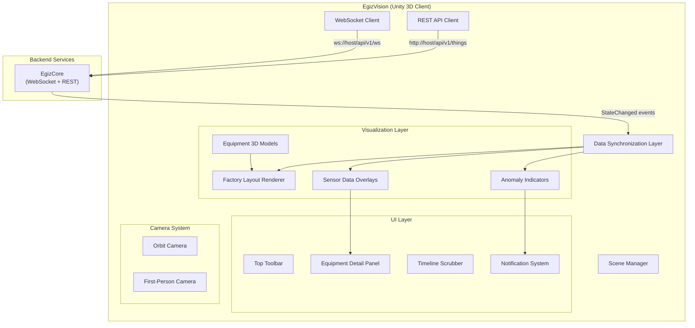

# PRD: EgizVision — Unity 3D Digital Twin Visualization Client

## Overview

EgizVision is a **real-time 3D visualization client** built in Unity that provides immersive, interactive views of the factory's digital twin. It connects to EgizCore via WebSocket to receive live state updates and renders equipment status, sensor data, and anomaly alerts in a spatial 3D environment.


---

## Problem Statement

Traditional factory monitoring relies on 2D dashboards (Grafana, custom web apps) that:

1. **Lack spatial context** — operators cannot see where equipment is located or understand physical relationships
2. **Require mental mapping** — translating sensor IDs to physical assets is cognitive overhead
3. **Miss visual patterns** — anomalies across multiple machines may be easier to spot in 3D
4. **Limited interactivity** — difficult to drill down, rotate, zoom, or explore dependencies

OpenEgiz requires a **3D visualization layer** that:

- Renders factory floor layouts with real-time equipment state
- Shows live sensor values overlaid on 3D models
- Highlights anomalies detected by EgizML
- Enables interactive exploration (click for details, filter by type, time-travel playback)
- Supports multi-user collaboration (future)

---

## Goals

| ID | Goal |
|----|------|
| **G-1** | Build Unity 3D client with WebGL and Desktop (Windows/Linux) targets |
| **G-2** | Connect to EgizCore via WebSocket for real-time state updates |
| **G-3** | Render 3D factory layout with equipment models (ovens, mixers, conveyors) |
| **G-4** | Display live sensor data as floating UI overlays (voltage, temperature, etc.) |
| **G-5** | Visualize anomaly alerts with color-coded indicators (red = critical, yellow = warning) |
| **G-6** | Enable camera controls: orbit, zoom, pan, and first-person walkthrough |
| **G-7** | Provide equipment detail panel on click (full sensor data, history chart) |
| **G-8** | Support time-travel playback of historical states (via EgizCore REST API) |

---

## Scope

### In Scope

**Core Features:**
- Unity 3D scene with factory floor layout
- WebSocket client for real-time data streaming from EgizCore
- REST API client for historical queries
- 3D equipment models (basic primitive shapes for MVP, custom models in Phase 2)
- Live sensor data visualization (floating UI labels, color-coded states)
- Anomaly alert visualization (pulsing red/yellow indicators)
- Interactive camera controls (orbit, zoom, pan, FPS mode)
- Equipment detail panel (inspector UI)
- Timeline scrubber for time-travel playback
- Desktop build (Windows/Linux) and WebGL build
- Settings panel (WebSocket URL, refresh rate, visual quality)

**UI Components:**
- Main 3D viewport
- Top toolbar (connection status, settings, view modes)
- Equipment detail panel (side drawer)
- Timeline scrubber (bottom panel, for playback)
- Notification system (alerts, errors)

### Out of Scope

- VR/AR support (Phase 3)
- Multi-user collaboration / multiplayer (Phase 2)
- Editable factory layouts (read-only for MVP)
- Mobile builds (iOS/Android)
- Advanced rendering (ray tracing, global illumination)
- Physics simulation
- Production planning / what-if analysis
- Integration with Mendix UI (separate system)

---

## Architecture



---

## User Stories

### US-001: WebSocket Connection to EgizCore
**Description:** As an operator, I want EgizVision to connect to EgizCore so I can see live equipment state.

**Acceptance Criteria:**
- [ ] Settings panel accepts EgizCore WebSocket URL (default: `ws://localhost:8080/api/v1/ws`)
- [ ] Client establishes WebSocket connection on startup
- [ ] Connection status indicator shows: Connected (green) / Disconnected (red) / Connecting (yellow)
- [ ] Auto-reconnect with exponential backoff (1s, 2s, 4s, 8s max)
- [ ] Error message displayed if connection fails after 5 retries
- [ ] Typecheck passes
- [ ] Verify in Unity Play Mode

### US-002: Render Factory Layout
**Description:** As an operator, I want to see a 3D representation of the factory floor so I can understand the spatial layout.

**Acceptance Criteria:**
- [ ] 3D scene includes floor plane (50m x 50m grid)
- [ ] Equipment positioned according to factory coordinates (loaded from config file)
- [ ] Basic 3D models for ovens, mixers, conveyors (primitive shapes: cubes, cylinders)
- [ ] Equipment labeled with device IDs (floating text above models)
- [ ] Camera starts at overhead view (30° angle, 50m distance)
- [ ] Typecheck passes
- [ ] Verify in Unity Play Mode

### US-003: Display Live Sensor Data
**Description:** As an operator, I want to see current sensor values overlaid on equipment so I can monitor status at a glance.

**Acceptance Criteria:**
- [ ] Subscribe to `sensors/#` via WebSocket on connection
- [ ] Parse incoming `StateChanged` events from EgizCore
- [ ] Display voltage, current, temperature as floating UI labels near equipment
- [ ] Update values in real-time (<200ms from EgizCore event)
- [ ] Color-code values: green (normal), yellow (warning), red (critical)
- [ ] Thresholds loaded from config (e.g., voltage >230V = red)
- [ ] Typecheck passes
- [ ] Verify in Unity Play Mode

### US-004: Visualize Anomaly Alerts
**Description:** As an operator, I want to see equipment with anomalies highlighted so I can quickly identify issues.

**Acceptance Criteria:**
- [ ] Equipment with `anomaly: true` in state shows pulsing red outline
- [ ] Notification toast appears when new anomaly detected
- [ ] Anomaly icon appears in equipment label
- [ ] Click anomaly icon to open detail panel with anomaly info
- [ ] Anomaly history shown in detail panel (last 10 anomalies)
- [ ] Typecheck passes
- [ ] Verify in Unity Play Mode

### US-005: Interactive Camera Controls
**Description:** As an operator, I want to control the camera so I can explore the factory from different angles.

**Acceptance Criteria:**
- [ ] Mouse drag (right-click) to orbit around factory center
- [ ] Mouse scroll to zoom in/out
- [ ] WASD keys for first-person camera movement
- [ ] Toggle between Orbit and FPS modes via toolbar button
- [ ] Camera collision detection (don't pass through equipment)
- [ ] Reset camera button returns to default overhead view
- [ ] Typecheck passes
- [ ] Verify in Unity Play Mode

### US-006: Equipment Detail Panel
**Description:** As an operator, I want to click on equipment to see detailed sensor data and history.

**Acceptance Criteria:**
- [ ] Click on 3D equipment model to select it
- [ ] Detail panel slides in from right side
- [ ] Shows all features and properties for selected Thing
- [ ] Displays mini line chart of last 1 hour of temperature/voltage
- [ ] "View History" button opens full historical chart (via REST API)
- [ ] Close button to dismiss panel
- [ ] Typecheck passes
- [ ] Verify in Unity Play Mode

### US-007: Time-Travel Playback
**Description:** As an operator, I want to scrub through historical states to investigate past anomalies.

**Acceptance Criteria:**
- [ ] Timeline scrubber at bottom of screen
- [ ] Select time range (last 1 hour, 6 hours, 24 hours)
- [ ] Drag scrubber handle to jump to specific time
- [ ] Play/pause button to auto-advance timeline
- [ ] Playback speed control (1x, 2x, 5x, 10x)
- [ ] EgizVision fetches historical data via REST API (`/api/v1/things/{id}/history`)
- [ ] 3D scene updates to show state at selected time
- [ ] "Live" button returns to real-time mode
- [ ] Typecheck passes
- [ ] Verify in Unity Play Mode

### US-008: WebGL Build Deployment
**Description:** As a developer, I want to build EgizVision for WebGL so users can access it via browser.

**Acceptance Criteria:**
- [ ] Unity project configured for WebGL build target
- [ ] Build output optimized for <50MB total size
- [ ] WebSocket connection works from browser (CORS configured)
- [ ] UI is responsive to browser window resize
- [ ] Hosted on static file server (Nginx or similar)
- [ ] Accessible at `http://localhost:8081/egizvision`
- [ ] Typecheck passes
- [ ] Verify in Chrome/Firefox browsers

---

## Functional Requirements

### FR-1: WebSocket Integration

| Requirement | Description |
|-------------|-------------|
| FR-1.1 | Use `websocket-sharp` or Unity native WebSocket library |
| FR-1.2 | Subscribe to specific Things or filter by type on connect |
| FR-1.3 | Handle `StateChanged` events and update scene |
| FR-1.4 | Implement heartbeat/ping-pong to keep connection alive |
| FR-1.5 | Queue messages if processing takes >16ms (maintain 60 FPS) |

### FR-2: REST API Integration

| Requirement | Description |
|-------------|-------------|
| FR-2.1 | Fetch Thing list on startup: `GET /api/v1/things` |
| FR-2.2 | Fetch historical data: `GET /api/v1/things/{id}/history?from=X&to=Y` |
| FR-2.3 | Parse JSON responses using `Newtonsoft.Json` or Unity JsonUtility |
| FR-2.4 | Handle HTTP errors gracefully (show notification) |

### FR-3: 3D Rendering

| Requirement | Description |
|-------------|-------------|
| FR-3.1 | Load factory layout from JSON config file |
| FR-3.2 | Instantiate equipment prefabs at configured positions |
| FR-3.3 | Update material colors based on state (green/yellow/red) |
| FR-3.4 | Render floating UI text using TextMeshPro |
| FR-3.5 | Use Unity's Universal Render Pipeline (URP) for optimization |

### FR-4: UI System

| Requirement | Description |
|-------------|-------------|
| FR-4.1 | Use Unity UI Canvas for all 2D UI elements |
| FR-4.2 | Toolbar: Connection status, settings button, view mode toggle |
| FR-4.3 | Detail panel: Expandable sections for each Feature |
| FR-4.4 | Timeline: Scrubber with time labels, play/pause controls |
| FR-4.5 | Notifications: Toast messages with auto-dismiss (5s) |

### FR-5: Camera System

| Requirement | Description |
|-------------|-------------|
| FR-5.1 | Orbit camera: Rotate around fixed center point |
| FR-5.2 | FPS camera: WASD movement + mouse look |
| FR-5.3 | Smooth camera transitions (lerp, slerp) |
| FR-5.4 | Camera bounds: Prevent moving outside factory area |

### FR-6: Configuration

| Requirement | Description |
|-------------|-------------|
| FR-6.1 | Load settings from `config.json` on startup |
| FR-6.2 | Configurable: WebSocket URL, REST API URL, update rate |
| FR-6.3 | Configurable: Color thresholds for sensors |
| FR-6.4 | Configurable: Factory layout (equipment positions) |

---

## Non-Functional Requirements

| ID | Requirement | Target |
|----|-------------|--------|
| NFR-1 | Frame rate (Desktop) | **60 FPS** (1080p) |
| NFR-2 | Frame rate (WebGL) | **30 FPS** (1080p) |
| NFR-3 | WebSocket update latency | **<200ms** (from EgizCore event) |
| NFR-4 | Scene load time | **<5 seconds** |
| NFR-5 | WebGL build size | **<50MB** |
| NFR-6 | Memory usage (Desktop) | **<1GB** |
| NFR-7 | Concurrent Things rendered | **1,000+ equipment models** |
| NFR-8 | Time-travel scrubber smoothness | **30 FPS** during playback |

---

## Data Model

### Factory Layout Config (`factory-layout.json`)

```json
{
  "factory": {
    "name": "Factory A",
    "bounds": {
      "width": 50,
      "depth": 50
    }
  },
  "equipment": [
    {
      "thing_id": "factory:oven-001",
      "type": "oven",
      "position": {"x": 10, "y": 0, "z": 5},
      "rotation": {"x": 0, "y": 0, "z": 0},
      "model": "prefabs/Oven_Basic"
    },
    {
      "thing_id": "factory:mixer-001",
      "type": "mixer",
      "position": {"x": 15, "y": 0, "z": 5},
      "rotation": {"x": 0, "y": 90, "z": 0},
      "model": "prefabs/Mixer_Basic"
    }
  ]
}
```

### Thing State (from EgizCore)

Matches the EgizCore Thing model (see `prd-egizcore.md`).

### Settings Config (`config.json`)

```json
{
  "egizcore": {
    "websocket_url": "ws://localhost:8080/api/v1/ws",
    "rest_url": "http://localhost:8080/api/v1"
  },
  "visualization": {
    "update_rate_ms": 100,
    "show_labels": true,
    "quality": "high"
  },
  "thresholds": {
    "voltage_warning": 225,
    "voltage_critical": 230,
    "temperature_warning": 200,
    "temperature_critical": 220
  }
}
```

---

## Technical Stack

| Component | Technology | Rationale |
|-----------|------------|-----------|
| Game Engine | **Unity 2022.3 LTS** | Industry standard, WebGL support, C# |
| Render Pipeline | **Universal Render Pipeline (URP)** | Optimized for WebGL and Desktop |
| UI | **Unity UI + TextMeshPro** | Native, GPU-accelerated text |
| WebSocket | `websocket-sharp` or native | Lightweight, cross-platform |
| HTTP Client | `UnityWebRequest` | Native, async/await support |
| JSON | `Newtonsoft.Json` | Feature-rich, widely used |
| Camera | `Cinemachine` | Smooth transitions, camera blend |
| Version Control | Git + Unity YAML | Merge-friendly scene files |

### Unity Packages

- **Cinemachine** — Advanced camera control
- **TextMeshPro** — High-quality text rendering
- **Newtonsoft.Json** — JSON serialization
- **websocket-sharp** — WebSocket client

### Directory Structure

```
EgizVision/
├── Assets/
│   ├── Scenes/
│   │   └── FactoryMain.unity
│   ├── Scripts/
│   │   ├── Core/
│   │   │   ├── AppManager.cs
│   │   │   ├── WebSocketClient.cs
│   │   │   └── RestApiClient.cs
│   │   ├── Data/
│   │   │   ├── ThingModel.cs
│   │   │   ├── FactoryLayout.cs
│   │   │   └── Config.cs
│   │   ├── Visualization/
│   │   │   ├── EquipmentRenderer.cs
│   │   │   ├── SensorOverlay.cs
│   │   │   └── AnomalyIndicator.cs
│   │   ├── UI/
│   │   │   ├── ToolbarController.cs
│   │   │   ├── DetailPanelController.cs
│   │   │   ├── TimelineController.cs
│   │   │   └── NotificationManager.cs
│   │   └── Camera/
│   │       ├── OrbitCameraController.cs
│   │       └── FPSCameraController.cs
│   ├── Prefabs/
│   │   ├── Equipment/
│   │   │   ├── Oven_Basic.prefab
│   │   │   ├── Mixer_Basic.prefab
│   │   │   └── Conveyor_Basic.prefab
│   │   └── UI/
│   │       ├── DetailPanel.prefab
│   │       ├── Notification.prefab
│   │       └── Timeline.prefab
│   ├── Materials/
│   │   ├── Equipment_Normal.mat
│   │   ├── Equipment_Warning.mat
│   │   └── Equipment_Critical.mat
│   ├── StreamingAssets/
│   │   ├── config.json
│   │   └── factory-layout.json
│   └── Editor/
│       └── LayoutEditor.cs (future: visual layout editor)
├── ProjectSettings/
├── Packages/
└── README.md
```

---

## Implementation Plan

### Phase 1: Project Setup (Week 1)

| Step | Task |
|------|------|
| 1.1 | Create Unity 2022.3 LTS project with URP template |
| 1.2 | Set up Git repository with Unity .gitignore |
| 1.3 | Install required packages (Cinemachine, TextMeshPro, Newtonsoft.Json) |
| 1.4 | Create basic factory scene with floor plane and lighting |
| 1.5 | Implement config loader (JSON → C# models) |

### Phase 2: WebSocket + REST Integration (Week 1)

| Step | Task |
|------|------|
| 2.1 | Implement WebSocketClient.cs with connection management |
| 2.2 | Implement RestApiClient.cs for Thing queries |
| 2.3 | Create ThingModel.cs data classes (match EgizCore schema) |
| 2.4 | Test connection to local EgizCore instance |
| 2.5 | Add connection status UI indicator |

### Phase 3: 3D Visualization (Week 2)

| Step | Task |
|------|------|
| 3.1 | Create basic equipment prefabs (primitives) |
| 3.2 | Implement EquipmentRenderer.cs to spawn models from layout |
| 3.3 | Implement SensorOverlay.cs for floating UI labels |
| 3.4 | Add color-coded materials (green/yellow/red) |
| 3.5 | Test live state updates from WebSocket |

### Phase 4: UI System (Week 2)

| Step | Task |
|------|------|
| 4.1 | Create toolbar UI (connection status, settings) |
| 4.2 | Create detail panel UI (inspector for selected equipment) |
| 4.3 | Implement NotificationManager for alerts |
| 4.4 | Add click detection on 3D models → show detail panel |
| 4.5 | Test UI responsiveness on different resolutions |

### Phase 5: Camera System (Week 3)

| Step | Task |
|------|------|
| 5.1 | Implement OrbitCameraController with mouse input |
| 5.2 | Implement FPSCameraController with WASD + mouse look |
| 5.3 | Add Cinemachine virtual cameras for smooth transitions |
| 5.4 | Add camera bounds and collision detection |
| 5.5 | Test camera switching and controls |

### Phase 6: Time-Travel Playback (Week 3)

| Step | Task |
|------|------|
| 6.1 | Create timeline UI with scrubber handle |
| 6.2 | Implement historical data fetching via REST API |
| 6.3 | Implement playback controller (play/pause, speed) |
| 6.4 | Update scene state based on timeline position |
| 6.5 | Test time-travel with real historical data |

### Phase 7: WebGL Build (Week 4)

| Step | Task |
|------|------|
| 7.1 | Configure Unity for WebGL build target |
| 7.2 | Optimize assets (compress textures, reduce poly count) |
| 7.3 | Test WebSocket connection from browser (CORS) |
| 7.4 | Build and deploy to static file server |
| 7.5 | Test in Chrome, Firefox, Edge |

---

## Verification Plan

### Automated Tests

| Test | Framework |
|------|-----------|
| Unit tests (C# logic) | Unity Test Framework (UTF) |
| Integration tests (WebSocket) | UTF + mock server |

### Manual Verification

- [ ] Launch Unity Editor → Play Mode → verify scene loads in <5s
- [ ] Connect to local EgizCore → verify WebSocket establishes connection
- [ ] Publish MQTT message → verify 3D model updates within 200ms
- [ ] Click on oven model → verify detail panel opens with sensor data
- [ ] Drag timeline scrubber → verify scene updates to historical state
- [ ] Switch to FPS camera → verify WASD movement works
- [ ] Build WebGL → open in browser → verify all features work
- [ ] Disconnect EgizCore → verify auto-reconnect after 5 retries

### Performance Testing

| Test | Target | Tool |
|------|--------|------|
| Desktop FPS (1000 Things) | 60 FPS | Unity Profiler |
| WebGL FPS (1000 Things) | 30 FPS | Chrome DevTools |
| WebSocket message latency | <200ms | Custom timestamp logging |
| Memory usage (Desktop) | <1GB | Unity Profiler |
| Build size (WebGL) | <50MB | File system |

### Success Metrics

| Metric | Target | Measurement |
|--------|--------|-------------|
| Real-time update latency | <200ms | WebSocket event → UI update |
| Scene load time | <5s | Unity Profiler |
| WebGL build size | <50MB | Build output directory |
| FPS (Desktop, 1000 Things) | 60 FPS | Unity Profiler |
| User clicks to view detail | 1 click | Interaction test |

---

## Open Questions

1. **3D Models**: Should we use free asset packs (Unity Asset Store) or hire 3D modeler for custom equipment?
2. **Multi-User**: When adding collaboration (Phase 2), use Photon or custom WebSocket multiplayer?
3. **Authentication**: How should users log in to EgizVision (Unity IAP, browser cookies, JWT)?
4. **Mobile**: Is mobile support (iOS/Android) required, or desktop + WebGL sufficient?
5. **VR Readiness**: Should architecture prepare for VR (Phase 3), or defer until needed?
6. **Chart Library**: Use Unity chart asset (e.g., Graph And Chart) or render custom line charts?

---

## Dependencies

| Dependency | Owner | Status |
|------------|-------|--------|
| EgizCore WebSocket endpoint | Backend team | 🟡 In progress (prd-egizcore.md) |
| EgizCore REST API | Backend team | 🟡 In progress (prd-egizcore.md) |
| Factory layout CAD files | Factory team | 🔴 Needed |
| 3D equipment models | Design team | 🔵 Planned |
| CORS configuration for WebGL | DevOps | 🔴 Needed |
| Static file hosting (Nginx) | DevOps | 🔵 Planned |

---

## Revision History

| Date | Version | Author | Changes |
|------|---------|--------|---------|
| 2026-01-29 | 1.0 | AI | Initial EgizVision PRD |
