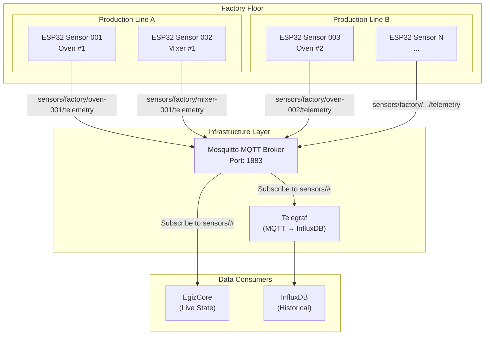

# PRD: Message Broker & Edge Sensors — Data Ingestion Layer

## Overview

The Message Broker and Edge Sensors form the **data ingestion foundation** of OpenEgiz. ESP32-based sensor modules collect real-time telemetry from factory equipment, publish data via MQTT to a centralized Mosquitto broker, and enable both live streaming (to EgizCore) and historical archiving (to InfluxDB).


---

## Problem Statement

Food production environments require:

1. **Low-cost, industrial-grade sensors** for voltage, current, temperature, and operational state monitoring
2. **Reliable message transport** that handles intermittent network connectivity
3. **Dual-path data flow**: real-time streaming to digital twin engine + historical archiving
4. **Scalability** to support 1,000+ sensors across multiple production lines
5. **Edge intelligence** for basic validation and buffering before transmission

Commercial IoT platforms (AWS IoT Core, Azure IoT Hub) are too expensive and complex for this use case. A lightweight, open-source MQTT-based architecture is required.

---

## Goals

| ID | Goal |
|----|------|
| **G-1** | Deploy ESP32 sensors for electrical, thermal, and status monitoring |
| **G-2** | Achieve **<1s** sensor reading to MQTT publish latency |
| **G-3** | Support **1,000+ concurrent sensor clients** via Mosquitto |
| **G-4** | Provide dual data paths: MQTT → EgizCore (live) + MQTT → InfluxDB (historical) |
| **G-5** | Enable **offline buffering** on ESP32 during network outages |
| **G-6** | Standardize MQTT topic schema and payload format |

---

## Scope

### In Scope

**ESP32 Edge Sensors:**
- Firmware for reading electrical parameters (voltage, current, power factor)
- Temperature sensor integration (DS18B20, thermocouples)
- Digital I/O for operational state (running/stopped/fault)
- MQTT client library (PubSubClient or similar)
- Local buffering (up to 100 messages) during network outages
- Wi-Fi connectivity with auto-reconnect
- OTA (Over-The-Air) firmware updates
- Device provisioning and configuration

**Mosquitto MQTT Broker:**
- MQTT 3.1.1 protocol support
- Topic-based publish/subscribe
- Retention policy for last-known-state
- Bridge configuration to InfluxDB (via Telegraf)
- Access control lists (ACL) for topic security
- Docker containerization
- Health monitoring and metrics

### Out of Scope

- Edge AI/ML inference on ESP32 (Phase 2)
- Bluetooth/LoRa connectivity (Wi-Fi only for MVP)
- Battery-powered sensors (AC-powered only)
- Multi-broker clustering (single instance for MVP)
- TLS/SSL encryption (Phase 2 security requirement)
- Custom PCB design (use off-the-shelf ESP32 dev boards)

---

## Architecture



---

## Data Model

### MQTT Topic Schema

```
sensors/{facility}/{device_type}-{device_id}/{data_type}
```

**Examples:**
- `sensors/factory/oven-001/telemetry`
- `sensors/factory/mixer-005/status`
- `sensors/factory/oven-001/config` (for device configuration)

### Telemetry Payload Format

**Standard JSON structure** published by ESP32:

```json
{
  "device_id": "oven-001",
  "timestamp": 1706352600,
  "electrical": {
    "voltage": {
      "a": 220.5,
      "b": 219.8,
      "c": 221.0
    },
    "current": {
      "a": 15.2,
      "b": 14.8,
      "c": 15.5
    },
    "power_factor": 0.92
  },
  "thermal": {
    "temperature_zones": [185.0, 190.0, 188.5],
    "setpoint": 190.0
  },
  "status": {
    "operational_state": "running",
    "wifi_rssi": -65,
    "uptime_seconds": 86400
  }
}
```

### Configuration Payload

**Topic:** `sensors/factory/{device_id}/config`

```json
{
  "device_id": "oven-001",
  "sampling_rate_ms": 1000,
  "publish_rate_ms": 5000,
  "buffer_size": 100,
  "wifi_ssid": "Factory-IoT",
  "mqtt_broker": "192.168.1.100:1883"
}
```

---

## Functional Requirements

### FR-1: ESP32 Sensor Firmware

| Requirement | Description |
|-------------|-------------|
| FR-1.1 | Read 3-phase voltage and current via PZEM-004T or similar module |
| FR-1.2 | Read temperature via DS18B20 digital sensors (1-Wire protocol) |
| FR-1.3 | Read digital I/O for operational state (GPIO-based) |
| FR-1.4 | Sample sensors every **1 second** (configurable) |
| FR-1.5 | Publish aggregated telemetry every **5 seconds** (configurable) |
| FR-1.6 | Buffer up to 100 messages in local SPIFFS during network outage |
| FR-1.7 | Auto-reconnect to Wi-Fi with exponential backoff |
| FR-1.8 | Auto-reconnect to MQTT broker with retry logic |
| FR-1.9 | Support OTA firmware updates via HTTP endpoint |
| FR-1.10 | Expose device health metrics (uptime, Wi-Fi RSSI, free memory) |

### FR-2: MQTT Broker (Mosquitto)

| Requirement | Description |
|-------------|-------------|
| FR-2.1 | Support MQTT 3.1.1 protocol |
| FR-2.2 | Handle 1,000+ concurrent client connections |
| FR-2.3 | Retain last message for each topic (QoS 1) |
| FR-2.4 | Configure ACL for topic-based access control |
| FR-2.5 | Expose metrics endpoint for Prometheus |
| FR-2.6 | Run as Docker container with persistent storage |
| FR-2.7 | Support message throughput of 10,000+ msg/sec |

### FR-3: InfluxDB Bridge (Telegraf)

| Requirement | Description |
|-------------|-------------|
| FR-3.1 | Subscribe to `sensors/#` topic pattern |
| FR-3.2 | Parse JSON payloads and map to InfluxDB line protocol |
| FR-3.3 | Tag data with device_id, facility, device_type |
| FR-3.4 | Write to InfluxDB with batch size of 1000 |
| FR-3.5 | Handle write failures with retry and backoff |

### FR-4: Device Provisioning

| Requirement | Description |
|-------------|-------------|
| FR-4.1 | Web-based provisioning interface (ESP32 AP mode) |
| FR-4.2 | Configure Wi-Fi credentials via web UI |
| FR-4.3 | Assign unique device_id during provisioning |
| FR-4.4 | Store configuration in EEPROM/SPIFFS |
| FR-4.5 | Fallback to AP mode if Wi-Fi connection fails |

---

## Non-Functional Requirements

| ID | Requirement | Target |
|----|-------------|--------|
| NFR-1 | Sensor reading to MQTT publish latency | **<1s** |
| NFR-2 | MQTT broker message throughput | **10,000 msg/sec** |
| NFR-3 | Concurrent MQTT clients | **1,000+ devices** |
| NFR-4 | ESP32 Wi-Fi reconnect time | **<10 seconds** |
| NFR-5 | Message delivery reliability (QoS 1) | **99.9%** |
| NFR-6 | MQTT broker uptime | **99.9%** |
| NFR-7 | ESP32 firmware OTA update time | **<2 minutes** |
| NFR-8 | Local buffer capacity (ESP32) | **100 messages** |

---

## Security Requirements (Phase 2)

> [!IMPORTANT]
> MVP phase uses unencrypted MQTT. Phase 2 must implement:

| ID | Requirement |
|----|-------------|
| SEC-1 | TLS 1.3 encryption for MQTT connections |
| SEC-2 | Device authentication via X.509 certificates |
| SEC-3 | Username/password authentication for MQTT clients |
| SEC-4 | ACL restricting devices to publish only to their own topics |
| SEC-5 | Network segmentation (IoT VLAN) |
| SEC-6 | Secure OTA firmware signing and verification |
| SEC-7 | No hardcoded credentials in firmware (use provisioning) |

---

## API Design

### MQTT Topic Structure

| Topic | Direction | QoS | Retained | Description |
|-------|-----------|-----|----------|-------------|
| `sensors/factory/{id}/telemetry` | ESP32 → Broker | 1 | Yes | Sensor data |
| `sensors/factory/{id}/status` | ESP32 → Broker | 1 | Yes | Device health |
| `sensors/factory/{id}/config` | Broker → ESP32 | 1 | Yes | Configuration updates |
| `sensors/factory/{id}/command` | Broker → ESP32 | 1 | No | Control commands |

### REST API for Device Management (Future)

| Endpoint | Method | Description |
|----------|--------|-------------|
| `/api/v1/devices` | GET | List all registered devices |
| `/api/v1/devices/{id}` | GET | Get device details |
| `/api/v1/devices/{id}/config` | PUT | Update device configuration |
| `/api/v1/devices/{id}/ota` | POST | Trigger OTA firmware update |

---

## Technical Stack

### ESP32 Firmware

| Component | Technology | Rationale |
|-----------|------------|-----------|
| Platform | **ESP32-DevKitC** | Low-cost ($5), Wi-Fi, dual-core |
| Framework | **Arduino / ESP-IDF** | Large community, easy development |
| MQTT Client | `PubSubClient` | Lightweight, stable |
| JSON Library | `ArduinoJson` | Efficient, zero-copy parsing |
| Temperature | DS18B20 (1-Wire) | Industrial-grade, digital |
| Electrical | PZEM-004T | AC voltage/current monitoring |
| Storage | SPIFFS | File system for buffering |
| OTA | `ArduinoOTA` or `ESP32-OTA` | Built-in support |

### MQTT Broker

| Component | Technology | Rationale |
|-----------|------------|-----------|
| Broker | **Eclipse Mosquitto 2.0** | Industry standard, lightweight |
| Container | Docker | Easy deployment |
| Monitoring | `prometheus-mqtt-exporter` | Metrics integration |

### InfluxDB Bridge

| Component | Technology | Rationale |
|-----------|------------|-----------|
| Agent | **Telegraf** | Native MQTT input plugin |
| Output | InfluxDB v2 | Time-series optimized |

### Directory Structure

```
edge-sensors/
├── firmware/
│   ├── src/
│   │   ├── main.cpp
│   │   ├── sensors/
│   │   │   ├── electrical.cpp
│   │   │   ├── temperature.cpp
│   │   │   └── status.cpp
│   │   ├── mqtt/
│   │   │   ├── client.cpp
│   │   │   └── buffer.cpp
│   │   ├── wifi/
│   │   │   └── manager.cpp
│   │   └── config/
│   │       └── provisioning.cpp
│   ├── platformio.ini
│   └── README.md
├── broker/
│   ├── mosquitto.conf
│   ├── acl.conf
│   ├── docker-compose.yml
│   └── README.md
├── telegraf/
│   ├── telegraf.conf
│   └── docker-compose.yml
└── docs/
    ├── wiring-diagram.md
    └── provisioning-guide.md
```

---

## Implementation Plan

### Phase 1: ESP32 Firmware (Week 1)

| Step | Task |
|------|------|
| 1.1 | Set up PlatformIO project with ESP32 target |
| 1.2 | Implement Wi-Fi connection manager with auto-reconnect |
| 1.3 | Implement MQTT client with reconnection logic |
| 1.4 | Integrate PZEM-004T for electrical measurements |
| 1.5 | Integrate DS18B20 for temperature readings |
| 1.6 | Implement GPIO reading for operational state |
| 1.7 | Create JSON telemetry payload builder |
| 1.8 | Add local SPIFFS buffering for offline mode |
| 1.9 | Test with single device publishing to local broker |

### Phase 2: MQTT Broker Setup (Week 1)

| Step | Task |
|------|------|
| 2.1 | Create Mosquitto Docker container configuration |
| 2.2 | Configure topic structure and retention policies |
| 2.3 | Set up basic ACL for topic permissions |
| 2.4 | Deploy prometheus-mqtt-exporter for monitoring |
| 2.5 | Test with 10 concurrent clients |
| 2.6 | Load test with 100+ simulated devices |

### Phase 3: InfluxDB Integration (Week 2)

| Step | Task |
|------|------|
| 3.1 | Configure Telegraf MQTT consumer plugin |
| 3.2 | Map JSON payloads to InfluxDB measurements |
| 3.3 | Set up InfluxDB bucket and retention policy (30 days) |
| 3.4 | Test end-to-end: ESP32 → MQTT → Telegraf → InfluxDB |
| 3.5 | Create Grafana dashboard for raw sensor data |

### Phase 4: Device Provisioning (Week 2)

| Step | Task |
|------|------|
| 4.1 | Implement ESP32 AP mode for initial setup |
| 4.2 | Create web UI for Wi-Fi and MQTT configuration |
| 4.3 | Store configuration in SPIFFS |
| 4.4 | Test provisioning flow with factory reset |

### Phase 5: OTA Updates (Week 3)

| Step | Task |
|------|------|
| 5.1 | Implement ArduinoOTA library integration |
| 5.2 | Create firmware versioning system |
| 5.3 | Test OTA update over Wi-Fi |
| 5.4 | Document OTA procedure |

---

## Verification Plan

### Automated Tests

| Test | Command |
|------|---------|
| Firmware build | `platformio run` |
| Unit tests (native) | `platformio test -e native` |
| Integration test | `platformio test -e esp32` |

### Manual Verification

- [ ] ESP32 boots and connects to Wi-Fi within 10 seconds
- [ ] MQTT client connects and publishes first message within 5 seconds
- [ ] Sensor data appears in MQTT broker (verify with `mosquitto_sub`)
- [ ] InfluxDB receives data within 10 seconds of publish
- [ ] Disconnect Wi-Fi → verify local buffering → reconnect → verify buffer flush
- [ ] Deploy 10 ESP32 devices → verify no message collisions
- [ ] Trigger OTA update → verify firmware version changes
- [ ] Factory reset → verify AP mode activates

### Load Testing

| Test | Target | Tool |
|------|--------|------|
| Concurrent MQTT clients | 1,000 | `mqtt-benchmark` |
| Message throughput | 10,000 msg/sec | Custom publisher script |
| Broker memory usage | <512MB | Docker stats |
| InfluxDB write latency | <100ms p99 | InfluxDB metrics |

### Success Metrics

| Metric | Target | Measurement |
|--------|--------|-------------|
| Sensor → MQTT latency | <1s | ESP32 log timestamps |
| MQTT → InfluxDB latency | <5s | Grafana query time |
| Message delivery rate | >99.9% | MQTT broker stats |
| Device reconnect time | <10s | Wi-Fi manager logs |

---

## Open Questions

1. **Power Supply**: Confirm 5V DC power availability near all monitored equipment, or need for AC-DC converters?
2. **Sensor Calibration**: Who handles initial calibration of PZEM modules (factory or on-site)?
3. **Device Naming**: Should device IDs be auto-generated (MAC-based) or manually assigned during provisioning?
4. **Network Architecture**: Dedicated IoT VLAN or shared factory network?
5. **OTA Strategy**: Push updates to all devices simultaneously, or gradual rollout?
6. **Alert Thresholds**: Should ESP32 firmware include basic threshold alerting, or leave to EgizCore/ML?

---

## Dependencies

| Dependency | Owner | Status |
|------------|-------|--------|
| Wi-Fi network credentials | IT team | 🔴 Needed |
| MQTT broker hostname/IP | DevOps | 🟡 In progress |
| InfluxDB connection details | DevOps | 🟡 In progress |
| PZEM-004T sensor procurement | Hardware team | 🔵 Planned |
| ESP32 dev board procurement | Hardware team | 🔵 Planned |
| Factory network access for devices | IT team | 🔴 Needed |

---

## Revision History

| Date | Version | Author | Changes |
|------|---------|--------|---------|
| 2026-01-29 | 1.0 | AI | Initial Message Broker & Sensors PRD |
