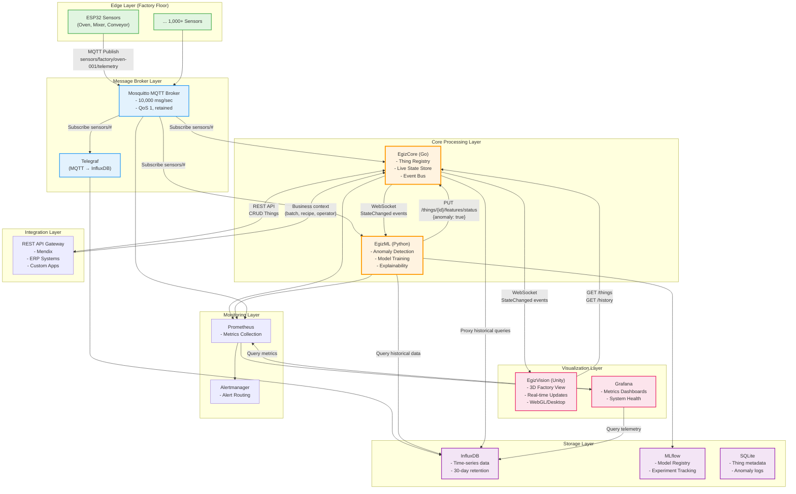

# PRD: OpenEgiz — Open-Source Industrial Digital Twin Platform

## Executive Summary

OpenEgiz is a **complete, open-source digital twin platform** for industrial food production environments. It provides real-time monitoring, 3D visualization, and AI-powered anomaly detection for factory equipment, bridging the gap between physical assets and digital intelligence.

The platform combines:
- **Edge sensors** (ESP32-based IoT devices)
- **Message infrastructure** (MQTT broker)
- **Digital twin engine** (Go-based state management)
- **3D visualization** (Unity client)
- **ML analytics** (Python anomaly detection)
- **Historical storage** (InfluxDB time-series database)
- **Business integration** (REST APIs for Mendix/ERP systems)


**Target Users:** Food production facilities, industrial manufacturers, factory operators, maintenance teams, and process engineers.

**License:** Open-source (MIT/Apache 2.0 - TBD)

---

## Problem Statement

Modern industrial facilities face critical challenges:

### 1. Equipment Downtime is Costly
- Unplanned failures cost $50,000+ per hour in lost production
- Reactive maintenance leads to cascading failures
- Lack of early warning systems prevents proactive intervention

### 2. Limited Visibility into Operations
- Operators rely on local HMIs with no centralized view
- Sensor data exists in silos (PLCs, SCADA, spreadsheets)
- No spatial understanding of equipment relationships
- Historical analysis requires manual data export and Excel

### 3. Existing Solutions are Inadequate
- **Commercial Digital Twin Platforms** (e.g., Eclipse Ditto, Azure Digital Twins):
  - Too expensive for mid-sized manufacturers ($50k-200k/year)
  - Vendor lock-in with proprietary protocols
  - Over-engineered for food production use cases
  - Require extensive IT infrastructure
  
- **SCADA Systems**:
  - Limited to real-time monitoring (no ML, no 3D)
  - Expensive per-tag licensing
  - Not designed for cloud/remote access
  
- **Custom In-House Solutions**:
  - Fragmented architecture (multiple tools/dashboards)
  - No standardization across factories
  - High maintenance burden

### 4. Lack of Predictive Intelligence
- Threshold-based alarms generate false positives
- No machine learning to detect subtle degradation patterns
- Anomalies discovered only after visible failures

---

## Vision and Goals

### Vision Statement

> **"Democratize industrial digital twins by providing an open-source, production-ready platform that any manufacturer can deploy, customize, and scale without vendor lock-in."**

### Platform Goals

| ID | Goal | Success Criteria |
|----|------|------------------|
| **G-1** | **Real-Time Digital Twin** | Maintain live state of 10,000+ assets with <200ms latency |
| **G-2** | **3D Spatial Visualization** | Provide immersive Unity-based factory visualization accessible via browser |
| **G-3** | **AI-Powered Anomaly Detection** | Detect equipment degradation with >80% accuracy, <5% false positive rate |
| **G-4** | **Open Architecture** | Enable integration with any MQTT device, REST client, or business system |
| **G-5** | **Low Total Cost of Ownership** | Deploy on commodity hardware for <$5,000 (excluding sensors) |
| **G-6** | **Horizontal Scalability** | Support multi-site deployments with centralized monitoring |
| **G-7** | **Developer-Friendly** | Provide comprehensive docs, APIs, and extensibility hooks |
| **G-8** | **Production-Ready** | Achieve 99.9% uptime with automated recovery and monitoring |

---

## Scope

### Platform Components (In Scope)

#### 1. **Edge Sensors & Message Broker**
- ESP32-based sensor modules (voltage, current, temperature)
- Mosquitto MQTT broker for message routing
- Telegraf bridge for InfluxDB archival
- Device provisioning and OTA firmware updates

#### 2. **EgizCore (Digital Twin Engine)**
- Go-based high-performance state engine
- Thing Registry (CRUD for digital assets)
- Live State Store (in-memory current state)
- REST API for business systems
- WebSocket API for real-time subscriptions
- InfluxDB integration for historical queries

#### 3. **EgizVision (3D Visualization Client)**
- Unity-based 3D factory viewer
- Real-time sensor data overlays
- Interactive camera controls and equipment inspection
- Time-travel playback of historical states
- WebGL and desktop builds

#### 4. **EgizML (Machine Learning Service)**
- Python FastAPI-based ML service
- Isolation Forest and Autoencoder anomaly detection
- Real-time inference with SHAP explainability
- MLflow model versioning and registry
- Automated weekly model retraining

#### 5. **Infrastructure & Operations**
- InfluxDB for time-series storage (30-day retention)
- Grafana dashboards for monitoring
- Prometheus metrics collection
- Docker-based deployment
- CI/CD pipelines (GitHub Actions)

### Out of Scope (Phase 2+)

- VR/AR visualization (Phase 3)
- Mobile apps (iOS/Android)
- Multi-tenant SaaS offering
- Predictive maintenance (RUL prediction)
- Root cause analysis automation
- Edge ML inference (on ESP32)
- Blockchain-based audit trails
- Integration with SAP/Oracle ERP (Phase 2)
- Multi-language UI support

---

## System Architecture



---

## Data Flow Scenarios

### Scenario 1: Real-Time Sensor Update

```
1. ESP32 reads oven temperature: 195°C (setpoint: 190°C)
2. ESP32 publishes to MQTT: sensors/factory/oven-001/telemetry
   {
     "device_id": "oven-001",
     "timestamp": 1706352600,
     "thermal": {"temperature_zones": [195, 192, 193]}
   }

3. Three subscribers receive message simultaneously:
   a) EgizCore: Updates Thing state in Live State Store
   b) Telegraf: Writes to InfluxDB for historical storage
   c) EgizML: Runs anomaly detection

4. EgizCore publishes StateChanged event via WebSocket

5. EgizVision receives event, updates 3D oven model color to yellow (warning)

6. EgizML detects anomaly (temp drift), sends alert to EgizCore:
   PUT /things/oven-001/features/status
   {"anomaly": true, "anomaly_score": 0.78, "top_features": ["temperature_zone_1"]}

7. EgizCore updates Thing state with anomaly flag

8. EgizVision shows pulsing red outline on oven model + notification toast

9. Operator clicks oven → Detail panel shows:
   - Current temp: 195°C
   - Anomaly score: 0.78
   - Contributing factor: Zone 1 temperature drift
   - Historical chart (fetched from InfluxDB via EgizCore)

Total latency: <3 seconds (sensor reading → operator notification)
```

### Scenario 2: Historical Analysis

```
1. Operator wants to investigate last week's anomaly spike

2. Opens EgizVision, selects timeline scrubber, picks last Monday 14:00

3. EgizVision sends REST request:
   GET /api/v1/things/oven-001/history?from=2026-01-20T14:00:00Z&to=2026-01-20T15:00:00Z

4. EgizCore proxies request to InfluxDB, returns time-series data

5. EgizVision renders:
   - 3D scene with oven state at 14:00
   - Historical chart showing temperature spike at 14:23
   - Voltage dip correlation at 14:22

6. Operator exports data for root cause analysis report
```

### Scenario 3: Model Retraining

```
1. Weekly cron job triggers: POST /train/oven-001

2. EgizML fetches 30 days of historical data from InfluxDB

3. Trains new Isolation Forest and Autoencoder models

4. Evaluates on validation set: F1 = 0.86 (improved from 0.83)

5. Saves new model to MLflow with version tag: v1.2

6. EgizML automatically switches to new model for inference

7. Old model archived for rollback if needed

8. Grafana dashboard shows model performance trend over time
```

---

## System-Level User Stories

### US-SYS-001: End-to-End Platform Deployment
**Description:** As a factory IT admin, I want to deploy the entire OpenEgiz platform using Docker Compose so I can get up and running quickly.

**Acceptance Criteria:**
- [ ] Single `docker-compose.yml` file deploys all services
- [ ] Services: MQTT, InfluxDB, EgizCore, EgizML, Grafana, Prometheus
- [ ] All containers start within 60 seconds
- [ ] Health checks confirm all services are ready
- [ ] Default credentials and config documented in README
- [ ] Accessible at: http://localhost:8080 (EgizCore), http://localhost:8081 (EgizVision), http://localhost:3000 (Grafana)
- [ ] Verify with: `docker-compose up -d && curl http://localhost:8080/health`

### US-SYS-002: Onboard New Equipment
**Description:** As a factory operator, I want to add a new oven to the system so I can monitor it in the digital twin.

**Acceptance Criteria:**
- [ ] Provision ESP32 sensor via web UI (AP mode)
- [ ] Configure device ID, MQTT broker, sampling rate
- [ ] Create Thing in EgizCore via REST API or admin UI
- [ ] Define Thing metadata (location, type, manufacturer)
- [ ] Verify MQTT messages flowing: `mosquitto_sub -t sensors/factory/oven-002/#`
- [ ] Verify Thing appears in EgizVision 3D scene within 10 seconds
- [ ] Verify historical data appears in InfluxDB within 30 seconds

### US-SYS-003: Respond to Anomaly Alert
**Description:** As a maintenance technician, I want to receive anomaly alerts and investigate the root cause using the 3D visualization.

**Acceptance Criteria:**
- [ ] EgizML detects anomaly (power factor drop on mixer-005)
- [ ] Notification appears in EgizVision within 5 seconds
- [ ] 3D model shows pulsing red outline
- [ ] Click on mixer → Detail panel shows:
  - Anomaly score: 0.82
  - Top features: power_factor (0.45), voltage_imbalance (0.37)
  - Historical chart with highlighted anomaly time
- [ ] Export anomaly report as PDF (feature exists or manual screenshot)
- [ ] Mark anomaly as "investigated" to clear notification

### US-SYS-004: Business System Integration
**Description:** As a business analyst, I want to enrich digital twin data with production context from Mendix so operators see batch/recipe info.

**Acceptance Criteria:**
- [ ] Mendix calls EgizCore REST API: `PUT /api/v1/things/oven-001/features/business_context`
- [ ] Payload includes: current_batch, recipe, operator_id
- [ ] EgizCore updates Thing state with business context
- [ ] EgizVision shows business context in detail panel
- [ ] EgizML uses business context as feature (optional: recipe-specific models)
- [ ] Historical queries can filter by batch_id

### US-SYS-005: Multi-Site Monitoring
**Description:** As a plant manager, I want to monitor multiple factories from a single dashboard.

**Acceptance Criteria:**
- [ ] Each factory runs dedicated EgizCore + MQTT instance
- [ ] Central Grafana aggregates metrics from all Prometheus instances
- [ ] Dashboard shows: factory health, anomaly count per site, top 10 critical assets
- [ ] Click on factory card → open EgizVision for that site
- [ ] Centralized alerting routes critical anomalies to on-call team

### US-SYS-006: Time-Travel Investigation
**Description:** As a process engineer, I want to replay past production runs to correlate anomalies with quality defects.

**Acceptance Criteria:**
- [ ] Select time range in EgizVision timeline (e.g., last Tuesday 08:00-16:00)
- [ ] Playback controls: play, pause, speed (1x, 5x, 10x)
- [ ] 3D scene updates to show equipment state at selected time
- [ ] Overlay quality data (if integrated) on timeline
- [ ] Identify correlation: temperature spike at 10:23 → defect batch reported at 10:45
- [ ] Export timeline with annotations for report

---

## Functional Requirements (System-Level)

### FR-SYS-1: Unified Configuration Management

| Requirement | Description |
|-------------|-------------|
| FR-SYS-1.1 | All services read config from environment variables or central config file |
| FR-SYS-1.2 | Support config override hierarchy: defaults → file → env vars |
| FR-SYS-1.3 | Sensitive data (passwords, API keys) stored in secrets (Docker secrets, K8s ConfigMap) |
| FR-SYS-1.4 | Config validation on startup with clear error messages |

### FR-SYS-2: Data Consistency

| Requirement | Description |
|-------------|-------------|
| FR-SYS-2.1 | Thing IDs are globally unique across all services |
| FR-SYS-2.2 | Timestamps are ISO 8601 UTC format |
| FR-SYS-2.3 | Feature schema is consistent between MQTT payload → EgizCore → EgizML |
| FR-SYS-2.4 | State version increments atomically to prevent race conditions |

### FR-SYS-3: High Availability

| Requirement | Description |
|-------------|-------------|
| FR-SYS-3.1 | All services support graceful shutdown (SIGTERM handling) |
| FR-SYS-3.2 | Auto-restart on failure (Docker restart policy: unless-stopped) |
| FR-SYS-3.3 | Health checks for all services (HTTP `/health` endpoint) |
| FR-SYS-3.4 | Circuit breakers for external dependencies (InfluxDB, MQTT) |

### FR-SYS-4: Observability

| Requirement | Description |
|-------------|-------------|
| FR-SYS-4.1 | Structured JSON logging with correlation IDs |
| FR-SYS-4.2 | Prometheus metrics exposed by all services |
| FR-SYS-4.3 | Distributed tracing (OpenTelemetry) for cross-service requests |
| FR-SYS-4.4 | Centralized log aggregation (optional: Loki or ELK stack) |

### FR-SYS-5: Security (Phase 2)

| Requirement | Description |
|-------------|-------------|
| FR-SYS-5.1 | JWT authentication for REST API |
| FR-SYS-5.2 | TLS 1.3 for all HTTP/WebSocket/MQTT connections |
| FR-SYS-5.3 | MQTT ACL: devices can only publish to their own topic |
| FR-SYS-5.4 | Rate limiting: 100 req/sec per client |
| FR-SYS-5.5 | Secrets rotation policy (90 days) |

### FR-SYS-6: Backup and Recovery

| Requirement | Description |
|-------------|-------------|
| FR-SYS-6.1 | Daily InfluxDB snapshots to S3-compatible storage |
| FR-SYS-6.2 | MLflow model registry backed up weekly |
| FR-SYS-6.3 | Thing registry export/import via JSON (disaster recovery) |
| FR-SYS-6.4 | Documented recovery procedure (RTO: 1 hour, RPO: 24 hours) |

---

## Non-Functional Requirements (System-Level)

### Performance

| ID | Requirement | Target | Measurement |
|----|-------------|--------|-------------|
| NFR-SYS-P1 | End-to-end latency (sensor → visualization) | **<3 seconds** | E2E timestamp logging |
| NFR-SYS-P2 | MQTT message throughput | **10,000 msg/sec** | MQTT broker metrics |
| NFR-SYS-P3 | Concurrent WebSocket clients | **1,000+ clients** | EgizCore load test |
| NFR-SYS-P4 | Historical query response time | **<2 seconds** (1-day range) | InfluxDB query perf |
| NFR-SYS-P5 | ML inference latency | **<100ms** | EgizML metrics |
| NFR-SYS-P6 | EgizVision frame rate | **60 FPS** (desktop, 1000 Things) | Unity Profiler |

### Scalability

| ID | Requirement | Target |
|----|-------------|--------|
| NFR-SYS-S1 | Total Things supported | **10,000+ assets** |
| NFR-SYS-S2 | Concurrent sensors (ESP32) | **1,000+ devices** |
| NFR-SYS-S3 | Historical data retention | **30 days** (configurable) |
| NFR-SYS-S4 | Horizontal scaling | Support 3+ EgizCore replicas with load balancer |

### Reliability

| ID | Requirement | Target |
|----|-------------|--------|
| NFR-SYS-R1 | System uptime | **99.9%** (43 minutes downtime/month) |
| NFR-SYS-R2 | Message delivery reliability | **99.9%** (QoS 1) |
| NFR-SYS-R3 | Data durability | **99.99%** (InfluxDB replication) |
| NFR-SYS-R4 | Mean Time to Recovery (MTTR) | **<15 minutes** |

### Resource Utilization

| ID | Requirement | Target |
|----|-------------|--------|
| NFR-SYS-U1 | Total server memory (10k Things) | **<8GB** |
| NFR-SYS-U2 | Total server CPU (idle) | **<20%** (4-core) |
| NFR-SYS-U3 | Total server CPU (peak) | **<80%** (4-core) |
| NFR-SYS-U4 | Storage growth rate | **~100GB/month** (1000 sensors @ 5s interval) |

### Usability

| ID | Requirement | Target |
|----|-------------|--------|
| NFR-SYS-UX1 | Deployment time (fresh install) | **<30 minutes** |
| NFR-SYS-UX2 | Time to first visualization | **<5 minutes** (after deployment) |
| NFR-SYS-UX3 | Learning curve | Junior developer can deploy in **<2 hours** |
| NFR-SYS-UX4 | Documentation coverage | **100%** of public APIs and configs |

---

## Technology Stack (Complete Platform)

| Layer | Component | Technology | Version |
|-------|-----------|------------|---------|
| **Edge** | Sensors | ESP32-DevKitC | - |
| | Firmware | Arduino/ESP-IDF | - |
| | Electrical Monitoring | PZEM-004T | - |
| | Temperature | DS18B20 | - |
| **Message** | MQTT Broker | Mosquitto | 2.0+ |
| | Metrics Exporter | prometheus-mqtt-exporter | - |
| **Core** | Digital Twin Engine | Go | 1.25.6 |
| | HTTP Router | go-chi/chi | v5 |
| | WebSocket | gorilla/websocket | - |
| | MQTT Client | paho.mqtt.golang | - |
| **ML** | ML Service | Python | 3.11 |
| | Web Framework | FastAPI | 0.109+ |
| | ML Framework | scikit-learn, PyTorch | - |
| | Model Registry | MLflow | 2.10+ |
| | Explainability | SHAP | 0.44+ |
| **Visualization** | 3D Client | Unity | 2022.3 LTS |
| | Render Pipeline | URP | - |
| | WebSocket | websocket-sharp | - |
| **Storage** | Time-Series DB | InfluxDB | 2.7+ |
| | Relational DB | SQLite (dev), PostgreSQL (prod) | - |
| **Monitoring** | Metrics | Prometheus | 2.45+ |
| | Dashboards | Grafana | 10.0+ |
| | Tracing | OpenTelemetry | - |
| **DevOps** | Containerization | Docker | 24.0+ |
| | Orchestration | Docker Compose (dev), K8s (prod) | - |
| | CI/CD | GitHub Actions | - |
| | Registry | Docker Hub / GHCR | - |

---

## Deployment Architecture

### Development Environment

```yaml
# docker-compose.yml (simplified)
services:
  mosquitto:
    image: eclipse-mosquitto:2.0
    ports: ["1883:1883", "9001:9001"]
    volumes: ["./mosquitto.conf:/mosquitto/config/mosquitto.conf"]
  
  influxdb:
    image: influxdb:2.7
    ports: ["8086:8086"]
    environment:
      - DOCKER_INFLUXDB_INIT_MODE=setup
      - DOCKER_INFLUXDB_INIT_USERNAME=admin
      - DOCKER_INFLUXDB_INIT_PASSWORD=adminpass
      - DOCKER_INFLUXDB_INIT_ORG=openegiz
      - DOCKER_INFLUXDB_INIT_BUCKET=sensors
  
  telegraf:
    image: telegraf:1.30
    volumes: ["./telegraf.conf:/etc/telegraf/telegraf.conf"]
    depends_on: [mosquitto, influxdb]
  
  egizcore:
    build: ./egizcore
    ports: ["8080:8080"]
    environment:
      - MQTT_BROKER=mosquitto:1883
      - INFLUXDB_URL=http://influxdb:8086
    depends_on: [mosquitto, influxdb]
  
  egizml:
    build: ./egizml
    ports: ["8000:8000"]
    environment:
      - EGIZCORE_WS_URL=ws://egizcore:8080/api/v1/ws
      - EGIZCORE_REST_URL=http://egizcore:8080/api/v1
      - MLFLOW_TRACKING_URI=http://mlflow:5000
    depends_on: [egizcore, mlflow]
  
  mlflow:
    image: ghcr.io/mlflow/mlflow:v2.10.0
    ports: ["5000:5000"]
    command: mlflow server --host 0.0.0.0
  
  prometheus:
    image: prom/prometheus:v2.45.0
    ports: ["9090:9090"]
    volumes: ["./prometheus.yml:/etc/prometheus/prometheus.yml"]
  
  grafana:
    image: grafana/grafana:10.0.0
    ports: ["3000:3000"]
    environment:
      - GF_SECURITY_ADMIN_PASSWORD=admin
    volumes: ["./grafana/dashboards:/etc/grafana/provisioning/dashboards"]
    depends_on: [prometheus, influxdb]
  
  egizvision:
    image: nginx:alpine
    ports: ["8081:80"]
    volumes: ["./egizvision/build:/usr/share/nginx/html"]
```

### Production Environment (Kubernetes)

```yaml
# Simplified K8s architecture
apiVersion: v1
kind: Namespace
metadata:
  name: openegiz

---
# StatefulSets for stateful services
- InfluxDB (persistent volume)
- MLflow (persistent volume)
- PostgreSQL (persistent volume)

# Deployments for stateless services
- EgizCore (3 replicas, HPA)
- EgizML (2 replicas)
- Mosquitto (1 replica, persistent volume)
- Grafana (1 replica)
- Prometheus (1 replica)

# Services
- LoadBalancer for EgizCore (external)
- ClusterIP for internal services

# Ingress
- TLS termination with cert-manager
- Path routing: /api → EgizCore, /ml → EgizML, /viz → EgizVision
```

---

## Implementation Roadmap

### Phase 1: Foundation (Weeks 1-4)

**Goal:** Working end-to-end data flow from sensor to visualization

| Week | Milestone | Deliverables |
|------|-----------|--------------|
| **Week 1** | Infrastructure Setup | - Docker Compose environment<br>- MQTT broker + InfluxDB running<br>- Basic ESP32 firmware (publish dummy data)<br>- EgizCore skeleton (REST API, WebSocket server) |
| **Week 2** | Digital Twin Core | - EgizCore Thing Registry implemented<br>- Live State Store with MQTT ingestion<br>- REST API endpoints (CRUD Things)<br>- WebSocket subscriptions working<br>- Unit tests (>80% coverage) |
| **Week 3** | 3D Visualization | - Unity project setup with URP<br>- WebSocket client connected to EgizCore<br>- Basic 3D scene with factory floor<br>- Equipment models (primitives) spawned from config<br>- Live sensor data overlays |
| **Week 4** | Integration Testing | - End-to-end test: ESP32 → MQTT → EgizCore → EgizVision<br>- Latency measurement (<3s target)<br>- InfluxDB historical data storage verified<br>- Basic Grafana dashboard for system metrics |

**Success Criteria:** Sensor publishes temperature → appears in Unity within 3 seconds

---

### Phase 2: Intelligence & Scalability (Weeks 5-8)

**Goal:** Add ML anomaly detection and scale to 1,000 Things

| Week | Milestone | Deliverables |
|------|-----------|--------------|
| **Week 5** | ML Service Foundation | - EgizML FastAPI service skeleton<br>- WebSocket client to EgizCore<br>- Data preprocessing pipeline<br>- Historical data fetcher from InfluxDB<br>- MLflow integration |
| **Week 6** | Anomaly Detection | - Isolation Forest training pipeline<br>- Autoencoder training pipeline<br>- Real-time inference engine<br>- Anomaly alerts published to EgizCore<br>- SHAP explainability |
| **Week 7** | UI/UX Enhancements | - EgizVision detail panel (equipment inspector)<br>- Anomaly indicators (pulsing red outlines)<br>- Timeline scrubber for time-travel<br>- Notification system<br>- Camera controls (orbit, FPS) |
| **Week 8** | Load Testing | - Simulate 1,000 ESP32 devices<br>- Load test MQTT broker (10k msg/sec)<br>- Load test EgizCore (1000 WebSocket clients)<br>- Optimize performance bottlenecks<br>- Horizontal scaling tests (K8s) |

**Success Criteria:** Detect anomaly with >80% accuracy, handle 1,000 devices concurrently

---

### Phase 3: Production Readiness (Weeks 9-12)

**Goal:** Security, monitoring, and deployment automation

| Week | Milestone | Deliverables |
|------|-----------|--------------|
| **Week 9** | Security Hardening | - JWT authentication for REST API<br>- TLS for MQTT/HTTP/WebSocket<br>- MQTT ACL configuration<br>- Rate limiting middleware<br>- Secrets management |
| **Week 10** | Observability | - Distributed tracing (OpenTelemetry)<br>- Centralized logging (Loki)<br>- Comprehensive Grafana dashboards<br>- Alertmanager rules (critical anomalies, system down)<br>- Runbook documentation |
| **Week 11** | DevOps & CI/CD | - GitHub Actions CI pipeline (build, test, lint)<br>- Automated Docker image builds<br>- Kubernetes manifests (Helm charts)<br>- Backup/restore procedures<br>- Infrastructure as Code (Terraform) |
| **Week 12** | Documentation & Release | - API documentation (OpenAPI/Swagger)<br>- Deployment guide (Docker, K8s)<br>- User manual for operators<br>- Developer onboarding guide<br>- Release v1.0.0 (GitHub release) |

**Success Criteria:** 99.9% uptime, <30 min deployment, comprehensive docs

---

### Phase 4: Advanced Features (Weeks 13-16)

**Goal:** Business integrations and advanced analytics

| Week | Milestone | Deliverables |
|------|-----------|--------------|
| **Week 13** | Business System Integration | - Mendix REST API integration<br>- Business context enrichment (batch, recipe)<br>- ERP data sync (production schedules)<br>- Custom report generation |
| **Week 14** | Advanced Visualization | - Custom 3D equipment models (CAD import)<br>- Heatmaps (temperature zones)<br>- Multi-site dashboard (aggregated view)<br>- WebGL performance optimization |
| **Week 15** | Predictive Maintenance | - Remaining Useful Life (RUL) prediction<br>- Degradation trend analysis<br>- Maintenance scheduling API<br>- Cost-benefit analysis dashboard |
| **Week 16** | Community & Ecosystem | - Open-source release (GitHub)<br>- Docker Hub official images<br>- Plugin architecture for custom sensors<br>- Community forum setup (Discourse) |

**Success Criteria:** Mendix integration working, open-source community launch

---

## Directory Structure (Complete Repository)

```
openegiz/
├── README.md
├── LICENSE (MIT or Apache 2.0)
├── CONTRIBUTING.md
├── CODE_OF_CONDUCT.md
├── docker-compose.yml          # Development environment
├── docker-compose.prod.yml     # Production environment
│
├── docs/
│   ├── architecture.md
│   ├── deployment-guide.md
│   ├── user-manual.md
│   ├── developer-guide.md
│   ├── api-reference.md
│   └── troubleshooting.md
│
├── prd-openegiz-platform.md    # This document
├── prd-egizcore.md
├── prd-messagebroker-sensors.md
├── prd-egizvision.md
├── prd-egizml.md
│
├── infrastructure/
│   ├── kubernetes/
│   │   ├── namespace.yaml
│   │   ├── egizcore-deployment.yaml
│   │   ├── egizml-deployment.yaml
│   │   ├── influxdb-statefulset.yaml
│   │   ├── mosquitto-deployment.yaml
│   │   └── ingress.yaml
│   ├── terraform/
│   │   ├── main.tf
│   │   ├── variables.tf
│   │   └── outputs.tf
│   └── ansible/
│       └── playbook.yml
│
├── egizcore/
│   ├── cmd/egizcore/main.go
│   ├── internal/
│   │   ├── thing/
│   │   ├── mqtt/
│   │   ├── api/
│   │   ├── ws/
│   │   └── influx/
│   ├── Dockerfile
│   ├── Makefile
│   ├── go.mod
│   └── README.md
│
├── egizml/
│   ├── src/
│   │   ├── main.py
│   │   ├── api/
│   │   ├── models/
│   │   ├── training/
│   │   └── inference/
│   ├── tests/
│   ├── Dockerfile
│   ├── requirements.txt
│   ├── pyproject.toml
│   └── README.md
│
├── egizvision/
│   ├── Assets/
│   │   ├── Scenes/
│   │   ├── Scripts/
│   │   ├── Prefabs/
│   │   └── StreamingAssets/
│   ├── ProjectSettings/
│   ├── Packages/
│   └── README.md
│
├── edge-sensors/
│   ├── firmware/
│   │   ├── src/main.cpp
│   │   ├── platformio.ini
│   │   └── README.md
│   ├── broker/
│   │   ├── mosquitto.conf
│   │   └── docker-compose.yml
│   └── telegraf/
│       └── telegraf.conf
│
├── monitoring/
│   ├── prometheus/
│   │   └── prometheus.yml
│   ├── grafana/
│   │   ├── dashboards/
│   │   │   ├── egizcore-dashboard.json
│   │   │   ├── egizml-dashboard.json
│   │   │   └── system-health-dashboard.json
│   │   └── datasources/
│   │       └── datasources.yaml
│   └── alertmanager/
│       └── alertmanager.yml
│
├── scripts/
│   ├── setup-dev.sh             # Development setup script
│   ├── deploy-prod.sh           # Production deployment
│   ├── backup.sh                # Backup InfluxDB + models
│   ├── load-test.py             # Simulate 1000 sensors
│   └── seed-data.py             # Generate test data
│
├── configs/
│   ├── factory-layout.json      # Factory 3D layout config
│   ├── thing-templates.json     # Thing type templates
│   └── env.example              # Environment variables template
│
├── .github/
│   ├── workflows/
│   │   ├── ci.yml               # Build, test, lint
│   │   ├── docker-publish.yml   # Publish Docker images
│   │   └── deploy.yml           # Auto-deploy to staging
│   └── ISSUE_TEMPLATE/
│       ├── bug_report.md
│       └── feature_request.md
│
└── examples/
    ├── custom-sensor/           # Example: Add custom sensor type
    ├── mendix-integration/      # Example: Mendix REST calls
    └── grafana-alerts/          # Example: Custom alert rules
```

---

## Verification & Testing Strategy

### Unit Testing

| Component | Framework | Coverage Target | Key Tests |
|-----------|-----------|-----------------|-----------|
| EgizCore | Go testing | >85% | Thing CRUD, State updates, WebSocket pub/sub |
| EgizML | pytest | >80% | Model training, Inference, Explainability |
| EgizVision | Unity Test Framework | >70% | WebSocket client, Data parsing, UI controllers |
| Edge Firmware | PlatformIO | >75% | Sensor reading, MQTT publish, Buffering |

### Integration Testing

| Test Suite | Scope | Tools |
|------------|-------|-------|
| **End-to-End** | ESP32 → MQTT → EgizCore → EgizVision | Testcontainers, Docker Compose |
| **API Contract** | REST API compatibility | Postman/Newman |
| **WebSocket** | Real-time message delivery | Custom async test harness |
| **ML Pipeline** | Training → Inference → Alert | pytest fixtures with mock data |

### Load Testing

| Test | Target | Tool | Acceptance Criteria |
|------|--------|------|---------------------|
| MQTT Throughput | 10,000 msg/sec | mqtt-benchmark | <1% message loss |
| WebSocket Clients | 1,000 concurrent | custom Go client | <200ms p99 latency |
| EgizCore REST API | 500 req/sec | wrk, k6 | <100ms p95 latency |
| InfluxDB Write | 10,000 points/sec | influx-stress | No write timeouts |
| EgizVision FPS | 60 FPS with 1000 Things | Unity Profiler | >58 FPS avg |

### Security Testing

| Test | Tool | Frequency |
|------|------|-----------|
| Dependency vulnerabilities | Snyk, Dependabot | Every commit |
| Container image scanning | Trivy | Every build |
| API security | OWASP ZAP | Weekly |
| Penetration testing | Manual + Burp Suite | Before production release |

### Chaos Engineering

| Scenario | Expected Behavior |
|----------|-------------------|
| MQTT broker crash | Clients reconnect within 10s, no data loss (buffered) |
| InfluxDB unavailable | EgizCore queues writes, retries with backoff |
| EgizCore restart | WebSocket clients reconnect, state repopulated from sensors |
| Network partition | ESP32 buffers locally, flushes when reconnected |
| High CPU load | Graceful degradation, no crashes |

---

## Success Metrics (KPIs)

### Technical Performance

| Metric | Target | Measurement Method |
|--------|--------|-------------------|
| **End-to-End Latency** | <3 seconds | Timestamp: sensor read → UI update |
| **System Uptime** | 99.9% | Prometheus uptime metric |
| **Anomaly Detection F1** | >0.80 | Validation set evaluation |
| **False Positive Rate** | <5% | Manual review of alerts |
| **Message Delivery Rate** | >99.9% | MQTT broker + EgizCore counters |
| **Historical Query Speed** | <2s (1-day range) | InfluxDB query logs |

### Business Impact

| Metric | Target | Measurement Method |
|--------|--------|-------------------|
| **Unplanned Downtime Reduction** | 30% in first 6 months | Compare pre/post deployment |
| **MTTR (Mean Time to Repair)** | 50% reduction | Incident logs analysis |
| **Early Failure Detection** | 80% of failures caught 1+ hour early | Anomaly timestamp vs actual failure |
| **Total Cost of Ownership** | <$5,000 (excluding sensors) | Infrastructure bill |

### User Adoption

| Metric | Target | Measurement Method |
|--------|--------|-------------------|
| **Time to First Value** | <5 minutes | User onboarding study |
| **Daily Active Users** | >80% of operators | EgizVision access logs |
| **GitHub Stars** | 500+ in first 6 months | GitHub metrics |
| **Community Contributors** | 10+ external contributors | GitHub insights |

### Operational Excellence

| Metric | Target | Measurement Method |
|--------|--------|-------------------|
| **Deployment Time** | <30 minutes | CI/CD pipeline duration |
| **Incident Response Time** | <15 minutes | Alertmanager → resolution time |
| **Data Retention Compliance** | 100% (30 days) | InfluxDB retention policy audit |
| **API Documentation Coverage** | 100% | OpenAPI spec completeness check |

---

## Risk Assessment & Mitigation

### Technical Risks

| Risk | Probability | Impact | Mitigation Strategy |
|------|-------------|--------|---------------------|
| **MQTT broker overload** | Medium | High | - Implement message rate limiting<br>- Add MQTT broker clustering (Phase 2)<br>- Monitor queue depth, alert on threshold |
| **EgizCore memory leak** | Low | High | - Comprehensive memory profiling (pprof)<br>- Automated stress tests in CI<br>- Memory limit + auto-restart policy |
| **ML model drift** | High | Medium | - Weekly automated retraining<br>- Model performance monitoring<br>- A/B testing for model updates |
| **InfluxDB disk space exhaustion** | Medium | High | - 30-day retention policy enforced<br>- Disk usage alerts (>80% threshold)<br>- Automated cleanup scripts |
| **Unity WebGL performance** | Medium | Medium | - Asset optimization (LOD, texture compression)<br>- WebAssembly build optimization<br>- Desktop app as alternative |

### Operational Risks

| Risk | Probability | Impact | Mitigation Strategy |
|------|-------------|--------|---------------------|
| **Wi-Fi connectivity issues** | High | Medium | - ESP32 local buffering (100 msgs)<br>- Wi-Fi signal strength monitoring<br>- Fallback to wired Ethernet (Phase 2) |
| **Power outages** | Low | High | - UPS for critical infrastructure<br>- Graceful shutdown procedures<br>- Auto-recovery on power restore |
| **Data breach** | Low | Critical | - TLS encryption (Phase 2)<br>- Network segmentation<br>- Regular security audits |
| **Vendor dependency** | Low | Medium | - All components open-source<br>- No vendor lock-in<br>- Self-hosted deployment |

### Business Risks

| Risk | Probability | Impact | Mitigation Strategy |
|------|-------------|--------|---------------------|
| **Low adoption** | Medium | High | - Comprehensive training program<br>- Clear ROI demonstration<br>- User feedback loop |
| **Lack of community support** | Medium | Medium | - Active GitHub maintenance<br>- Dedicated Discord/Slack channel<br>- Quarterly virtual meetups |
| **Competitor launch** | Medium | Low | - Focus on unique value (open-source + food production)<br>- Rapid feature iteration<br>- Strong community engagement |

---

## Open Questions & Decisions Needed

### Technical Decisions

1. **State Persistence Strategy**
   - Question: Should EgizCore persist state to Redis/PostgreSQL for restart recovery, or rely on re-population from sensors?
   - Options:
     - A) Ephemeral (current): Fast, simple, but state lost on restart
     - B) Redis snapshot: Fast recovery, adds complexity
     - C) Event sourcing: Full audit trail, high complexity
   - Recommendation: Start with A (ephemeral), add B in Phase 2

2. **Authentication Provider**
   - Question: Which auth system for production?
   - Options:
     - A) Custom JWT (implemented in EgizCore)
     - B) OAuth2 (Keycloak, Auth0)
     - C) LDAP/Active Directory integration
   - Recommendation: A for Phase 1, B for enterprise deployments (Phase 2)

3. **Kubernetes vs Docker Swarm**
   - Question: Which orchestrator for production?
   - Recommendation: Docker Compose (dev), Kubernetes (prod) for maturity and ecosystem

4. **Multi-Tenancy Architecture**
   - Question: How to support multiple factories in one deployment?
   - Options:
     - A) Namespace isolation (single cluster)
     - B) Separate deployments per factory
     - C) Schema-based multi-tenancy (database-level)
   - Recommendation: B for Phase 1 (simplicity), A for Phase 3 (efficiency)

### Business Decisions

5. **Open-Source License**
   - Question: MIT (permissive) or Apache 2.0 (patent protection)?
   - Recommendation: Apache 2.0 for better patent protection

6. **Commercial Support Model**
   - Question: How to monetize while keeping core open-source?
   - Options:
     - A) Pure open-source (donations, sponsorships)
     - B) Open-core (paid enterprise features)
     - C) Support contracts (consulting, SLA)
   - Recommendation: Start with A, add C as community grows

7. **Trademark & Branding**
   - Question: Should "OpenEgiz" be trademarked?
   - Recommendation: Yes, to prevent brand confusion while keeping code open

---

## Dependencies & Prerequisites

### External Dependencies

| Dependency | Owner | Status | Deadline | Risk |
|------------|-------|--------|----------|------|
| Factory Wi-Fi credentials | IT Team | 🔴 Needed | Week 1 | High |
| MQTT broker hostname/IP | DevOps | 🟡 In progress | Week 1 | Medium |
| Factory layout CAD files | Facilities | 🔴 Needed | Week 3 | Medium |
| 30 days historical sensor data | Operations | 🔴 Needed | Week 5 | High |
| Production server specs confirmed | IT Team | 🔵 Planned | Week 8 | Low |
| Mendix API documentation | Business IT | 🟡 In progress | Week 13 | Low |

### Internal Prerequisites

| Prerequisite | Responsible | Completion Date |
|--------------|-------------|-----------------|
| GitHub organization setup | DevOps | Week 0 |
| Development environment (Docker) | DevOps | Week 1 |
| CI/CD pipeline (GitHub Actions) | DevOps | Week 2 |
| MLflow tracking server | Data Science | Week 5 |
| Kubernetes cluster (staging) | DevOps | Week 8 |
| Production cluster provisioning | DevOps | Week 11 |

---

## Documentation Plan

### Developer Documentation

| Document | Audience | Status |
|----------|----------|--------|
| **Architecture Overview** | Developers, Architects | 🟡 Draft in this PRD |
| **API Reference** (OpenAPI) | Developers | 🔵 Week 4 |
| **Developer Onboarding Guide** | New contributors | 🔵 Week 12 |
| **Code Style Guide** | Contributors | 🔵 Week 2 |
| **Testing Guide** | QA, Developers | 🔵 Week 6 |

### Operator Documentation

| Document | Audience | Status |
|----------|----------|--------|
| **User Manual** | Factory operators | 🔵 Week 12 |
| **Deployment Guide** | IT admins | 🔵 Week 11 |
| **Troubleshooting Guide** | Support team | 🔵 Week 12 |
| **Runbook** (incidents) | On-call engineers | 🔵 Week 10 |

### Business Documentation

| Document | Audience | Status |
|----------|----------|--------|
| **ROI Calculator** | Management | 🔵 Week 16 |
| **Case Studies** | Prospects | 🔵 Post-deployment |
| **Roadmap** | Stakeholders | 🟡 This PRD |

---

## Maintenance & Support Plan

### Release Cycle

- **Major releases** (1.0, 2.0): Every 6 months
- **Minor releases** (1.1, 1.2): Every 2 months
- **Patch releases** (1.0.1): As needed (security fixes)

### Long-Term Support (LTS)

- LTS versions: Every 12 months (1.0, 2.0, etc.)
- Support duration: 18 months
- Security patches: 24 months

### Community Support

- **GitHub Issues**: Bug reports, feature requests
- **Discussions**: Q&A, architecture discussions
- **Discord/Slack**: Real-time community chat
- **Quarterly Meetups**: Virtual community calls

### Professional Support (Phase 2)

- **Tier 1**: Email support (48h response)
- **Tier 2**: Priority support (24h response) + monthly check-in
- **Tier 3**: 24/7 support + dedicated Slack channel + quarterly on-site review

---

## Glossary

| Term | Definition |
|------|------------|
| **Thing** | Digital twin representation of a physical asset (oven, mixer, etc.) |
| **Feature** | Logical grouping of properties (e.g., "electrical", "thermal") |
| **Live State** | Current, in-memory state of all Things |
| **State Change Event** | WebSocket message indicating a Thing's state was updated |
| **Anomaly Score** | ML model output indicating likelihood of abnormal behavior (0-1) |
| **Time-Travel** | Replaying historical states in the visualization |
| **MQTT Topic** | Hierarchical channel for publish/subscribe messaging |
| **QoS (Quality of Service)** | MQTT message delivery guarantee (0=at most once, 1=at least once) |
| **Retention Policy** | InfluxDB configuration for automatic data expiration |
| **Model Registry** | MLflow storage for versioned ML models |
| **SHAP Values** | Explainability scores showing feature contribution to predictions |

---

## Revision History

| Date | Version | Author | Changes |
|------|---------|--------|---------|
| 2026-01-29 | 1.0 | AI | Initial master PRD for OpenEgiz platform |

---

## Appendices

### Appendix A: Component PRDs
- [PRD: EgizCore](prd-egizcore.md)
- [PRD: Message Broker & Sensors](prd-messagebroker-sensors.md)
- [PRD: EgizVision](prd-egizvision.md)
- [PRD: EgizML](prd-egizml.md)

### Appendix B: Reference Architecture Diagram
See `openegiz_architecture.png`

### Appendix C: API Quick Reference

**EgizCore REST API:**
```
GET    /api/v1/things              # List all Things
POST   /api/v1/things              # Create Thing
GET    /api/v1/things/{id}         # Get Thing
DELETE /api/v1/things/{id}         # Delete Thing
PUT    /api/v1/things/{id}/features/{feature}  # Update Feature
GET    /api/v1/things/{id}/history # Historical data
POST   /api/v1/query               # Query Things
GET    /health                     # Health check
```

**EgizML REST API:**
```
POST   /train/{thing_id}           # Train model
GET    /models                     # List models
GET    /anomalies/{thing_id}       # Recent anomalies
GET    /health                     # Health check
GET    /metrics                    # Prometheus metrics
```

**EgizCore WebSocket:**
```javascript
// Subscribe to specific Thing
{"action": "subscribe", "thingId": "factory:oven-001"}

// Subscribe by filter
{"action": "subscribe", "filter": {"type": "oven"}}

// Receive state changes
{"event": "StateChanged", "thingId": "...", "feature": "...", "properties": {...}}
```

### Appendix D: Hardware Bill of Materials (Single Sensor Node)

| Component | Model | Quantity | Unit Cost | Total |
|-----------|-------|----------|-----------|-------|
| Microcontroller | ESP32-DevKitC | 1 | $5 | $5 |
| Electrical Sensor | PZEM-004T | 1 | $15 | $15 |
| Temperature Sensor | DS18B20 | 3 | $2 | $6 |
| Enclosure | IP65 rated | 1 | $10 | $10 |
| Power Supply | 5V 2A | 1 | $5 | $5 |
| Wiring & Connectors | - | - | $5 | $5 |
| **Total per sensor node** | | | | **$46** |

**Note:** 1,000 sensors ≈ $46,000 hardware cost

### Appendix E: Server Requirements

**Development Environment:**
- CPU: 4 cores
- RAM: 8GB
- Disk: 100GB SSD
- Network: 100 Mbps

**Production Environment (1,000 sensors):**
- CPU: 16 cores (2x servers with 8 cores each)
- RAM: 32GB (16GB per server)
- Disk: 1TB SSD (InfluxDB + models)
- Network: 1 Gbps
- Estimated cost: ~$200/month (cloud) or $4,000 (on-prem servers)

---

## Next Steps

1. **Review & Approval** (Week 0)
   - [ ] Stakeholder review of this PRD
   - [ ] Secure budget approval
   - [ ] Assign project lead and team

2. **Kickoff** (Week 1, Day 1)
   - [ ] Team kickoff meeting
   - [ ] Set up GitHub organization
   - [ ] Provision development servers
   - [ ] Create project board (GitHub Projects)

3. **Sprint 0** (Week 1)
   - [ ] Set up Docker Compose environment
   - [ ] Initialize all code repositories
   - [ ] Configure CI/CD pipelines
   - [ ] Write "Hello World" for each component

4. **Begin Phase 1** (Week 1)
   - [ ] Refer to Implementation Roadmap above
   - [ ] Daily standups
   - [ ] Weekly sprint reviews

---

**For questions or feedback, contact:**
- Project Lead: [TBD]
- Technical Architect: [TBD]
- GitHub: https://github.com/openegiz/openegiz
